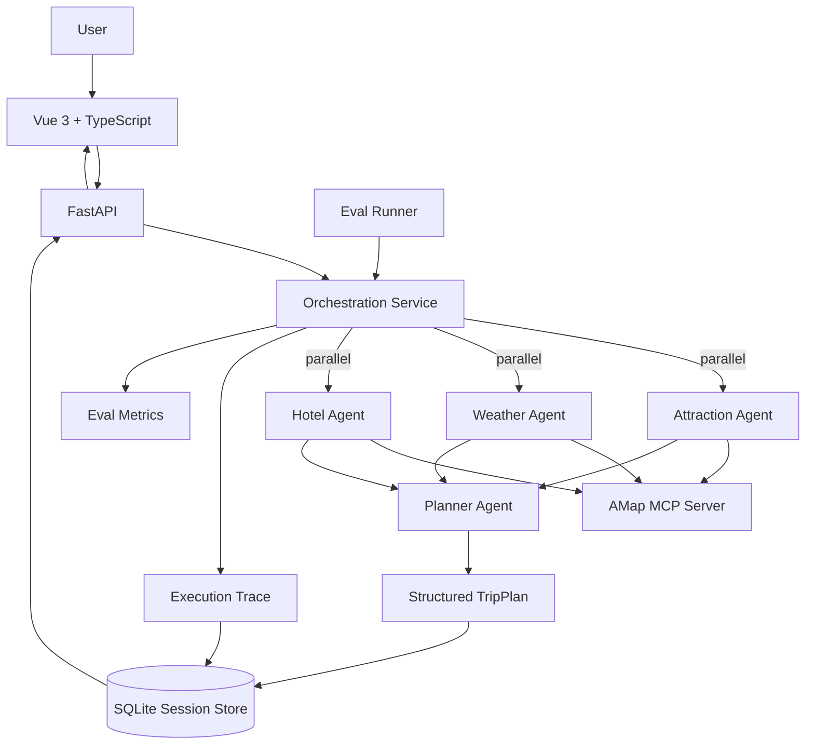

# Multi-Agent Trip Planner

一个面向真实旅行规划场景的 **Multi-Agent AI Application**。

项目基于 HelloAgents 构建多个专职 Agent，通过 **MCP（Model Context Protocol）** 接入高德地图能力，并使用 FastAPI + Vue 3 完成任务编排、工具调用、结构化输出、会话持久化、自然语言修订、执行追踪与 Agent Eval。

> 项目的重点不是“让大模型生成一段旅行文案”，而是验证如何把 **Agent Orchestration、Tool Calling、Structured Output、Reliability、State、Observability 与 Evaluation** 组合成一个可运行、可调试、可评估的 Agent System。

## Highlights

- **Multi-Agent Decomposition**：Attraction / Weather / Hotel / Planner 职责拆分
- **Parallel Orchestration**：三个检索型 Agent 使用 fan-out / fan-in 并行执行
- **MCP Tool Calling**：通过高德地图 MCP 获取真实外部信息
- **Structured Output**：Planner 输出受 Pydantic 约束的 `TripPlan`
- **Request-scoped Agents**：每次请求创建独立 Agent 上下文，避免历史消息跨请求污染
- **Reliability Policy**：异常分类、有限重试、退避与显式 fallback
- **Persistent Session**：SQLite 保存当前计划、历史版本和执行轨迹
- **Natural-language Revision**：基于 `session_id` 对现有计划做局部自然语言修改
- **Agent Observability**：独立 Trace 页面展示 Tool / Status / Latency / Retry / Error
- **Deterministic Eval**：固定测试集衡量结构化输出、Agent 成功率、fallback 与延迟
- **Offline CI**：GitHub Actions 自动执行 Python 编译、可靠性单测与前端 TypeScript Build

## Architecture



## Agent Workflow

```text
User Request
    ↓
FastAPI
    ↓
Orchestrator
    ├── Attraction Agent ── MCP ─┐
    ├── Weather Agent ───── MCP ─┼── parallel
    └── Hotel Agent ─────── MCP ─┘
                    ↓ fan-in
               Planner Agent
                    ↓
             Structured TripPlan
                    ↓
       SQLite Session + Execution Trace
                    ↓
             Vue Result / Trace UI
```

Attraction、Weather、Hotel 三个任务互不依赖，因此并行执行；Planner 等待三者结果汇合后生成最终 `TripPlan`。

## Reliability

项目把常见异常统一归类为：

```text
timeout
rate_limit
network
auth
validation
agent_error
```

默认配置：

```env
LLM_TIMEOUT=120
AGENT_MAX_RETRIES=2
AGENT_RETRY_BACKOFF_SECONDS=0.5
```

策略不是“所有错误都重试”：

- 网络、限流、超时等瞬时错误允许重试
- 认证错误不重试
- 普通检索步骤的 validation 错误不盲目重试
- Planner 如果只是生成了非法 JSON / 不符合 `TripPlan`，允许重新生成
- 所有 Planner 尝试失败后才进入 fallback
- fallback 不伪造景点、经纬度、天气或预算，而是返回明确的降级状态

模型请求的实际超时由 LLM Provider / `LLM_TIMEOUT` 负责，避免使用无法安全终止的线程伪造“强制超时”。

## Request Isolation

HelloAgents 的 Agent 实例会维护当前对话上下文，因此业务层不复用同一个 `SimpleAgent` 承载不同请求。

当前实现复用的是系统配置、LLM 配置和 MCP 能力；每次旅行规划都会重新创建：

```text
Attraction Agent
Weather Agent
Hotel Agent
Planner Agent
```

这样不同用户请求、不同 Eval case 之间不会因为历史消息发生上下文串扰。

## Agent Execution Trace

每个步骤都会记录类似事件：

```json
{
  "agent": "Weather Agent",
  "task": "查询目的地天气",
  "tool": "amap_maps_weather",
  "status": "success",
  "duration_ms": 1264.42,
  "attempts": 2,
  "error_category": null,
  "retry_errors": []
}
```

前端 `/trace` 页面展示：

- 三个并行检索 Agent
- Planner 汇总节点
- MCP Tool 名称
- 单步和整体 latency
- 尝试次数与 retry history
- error category
- failed / fallback / degraded 状态
- 简短结果预览

## Persistent Session & Revision

首次生成计划后会创建 `session_id`，SQLite 保存：

```text
session_id
current_plan
history
execution_trace
created_at
updated_at
```

用户可以继续输入：

```text
把第二天上午的博物馆换成适合拍照的公园，其他安排不变。
```

Revision Agent 基于当前计划做局部修改；旧版本进入 `history`，相关 Trace 会继续追加。

## Deterministic Agent Eval

当前优先做 **可重复、可解释的工程 Eval**，而不是先引入 LLM-as-a-Judge。

默认测试集包含北京、上海、广州、成都、西安、杭州、南京、深圳等场景，并检查：

- 目的地和天数是否匹配请求
- `day_index` 是否连续
- 每天最少景点数量
- 早餐 / 午餐 / 晚餐是否完整
- 经纬度是否在合法范围
- 天气是否覆盖旅行日期
- 预算是否存在且汇总一致
- Attraction / Weather / Hotel Agent 是否成功
- Planner 是否成功输出结构化 `TripPlan`
- 是否发生 fallback

聚合指标包括：

```text
case_pass_rate
average_check_score
structured_output_success_rate
retrieval_agent_success_rate
fallback_rate
agent_step_retry_rate
average_latency_ms
p95_latency_ms
error_categories
```

### Run Eval

在 `backend/` 目录：

```bash
python -m evals.run_eval
```

快速跑前三条：

```bash
python -m evals.run_eval --limit 3
```

指定场景：

```bash
python -m evals.run_eval --case beijing-culture-3d
```

设置质量门槛：

```bash
python -m evals.run_eval --min-pass-rate 0.8
```

结果默认写入：

```text
backend/evals/reports/latest.json
```

报告目录已加入 `.gitignore`。README 不预填虚构的成功率或延迟数据，只有真实环境跑完 Eval 后才应把实际指标写进简历。

## CI

`.github/workflows/ci.yml` 在 `main` push 和 Pull Request 时运行两组离线检查：

```text
Backend
  ├── install dependencies
  ├── python -m compileall app evals
  └── pytest tests -q

Frontend
  ├── npm ci
  └── npm run build
```

CI 不调用真实 LLM 或高德 MCP，因此不会消耗模型 API；真实 Agent Eval 仍应在配置受保护密钥的环境中执行。

## Tech Stack

### Agent / Backend

- Python
- HelloAgents / SimpleAgent
- MCPTool / Model Context Protocol
- AMap MCP Server
- FastAPI
- Pydantic
- SQLite
- `ThreadPoolExecutor`
- pytest
- GitHub Actions

### Frontend

- Vue 3
- TypeScript
- Vue Router
- Vite
- Ant Design Vue
- Axios
- AMap JavaScript API
- html2canvas / jsPDF

## Project Structure

```text
multi-agent-trip-planner/
├── .github/
│   └── workflows/
│       └── ci.yml
├── backend/
│   ├── app/
│   │   ├── agents/
│   │   │   └── trip_planner_agent.py
│   │   ├── api/routes/
│   │   │   └── trip.py
│   │   ├── models/
│   │   │   └── schemas.py
│   │   └── services/
│   │       ├── orchestration_service.py
│   │       ├── resilience_service.py
│   │       └── session_service.py
│   ├── evals/
│   │   ├── cases.json
│   │   └── run_eval.py
│   ├── tests/
│   │   └── test_resilience_service.py
│   ├── requirements.txt
│   └── requirements-dev.txt
├── frontend/
│   └── src/
│       ├── views/
│       │   ├── Home.vue
│       │   ├── Result.vue
│       │   └── Trace.vue
│       └── types/
└── README.md
```

## Quick Start

### Backend

```bash
cd backend
python -m venv venv
source venv/bin/activate
pip install -r requirements.txt
cp .env.example .env
uvicorn app.api.main:app --reload --host 0.0.0.0 --port 8000
```

FastAPI Docs：`http://localhost:8000/docs`

### Frontend

```bash
cd frontend
npm install
cp .env.example .env
npm run dev
```

默认访问：`http://localhost:5173`

生成一次旅行计划后可以访问 `/trace` 查看当前 Session 的执行轨迹。

## Core APIs

```http
POST /api/trip/plan
POST /api/trip/revise
GET  /api/trip/session/{session_id}
GET  /api/trip/trace/{session_id}
```

## Engineering Decisions

### Why separate Orchestrator from Agent implementation?

Agent 层负责专业能力与 Prompt；Orchestrator 负责：

```text
依赖关系
并行调度
fan-out / fan-in
错误隔离
retry policy
latency
trace
```

这样后续增加 Coordinator、DAG 或异步任务队列时，不需要继续把调度逻辑堆进 Agent 类。

### Why request-scoped Agents?

会话记忆属于一次业务请求，而不应该属于整个 FastAPI 进程。复用有状态 Agent 单例容易造成不同请求之间的上下文污染，因此 Agent 在请求作用域内创建。

### Why deterministic Eval before LLM-as-a-Judge?

结构正确性、工具成功率、fallback、约束满足和延迟都有明确判定方式。先把这些基础指标建立起来，更适合作为回归测试；主观的旅行质量以后再增加 rubric / semantic judge。

### Why SQLite first?

当前定位是单机作品集应用。SQLite 以很低复杂度解决进程重启后 Session 丢失的问题；未来部署为多实例时再替换 PostgreSQL / Redis。

### Why not A2UI now?

当前 TripPlan 的主要 UI 结构是稳定的：行程、天气、酒店、预算、地图、每日安排。

变化主要是：

```text
业务数据动态
```

而不是：

```text
UI 结构动态
```

因此当前采用：

```text
Typed TripPlan
    ↓
Deterministic Vue Components
```

而不是为了增加技术关键词引入动态 UI 协议。

如果未来项目演进成通用 Travel Agent Workspace，同一个 Agent 会根据任务动态生成比较表、审批表单、选择器、预算编辑器等不同 Surface，再考虑 A2UI 更合理。

## Current Boundaries

- Agent 路由仍是固定任务图，还不是动态 Coordinator / Router
- Tool Calling 仍依赖当前 HelloAgents / Prompt 约定，尚未升级为更严格的 typed tool schema
- Trace 尚未记录 token usage 与完整 LLM span
- retry 当前主要在 Agent step 层，MCP Tool 层还没有 circuit breaker
- Session Store 使用 SQLite，暂未面向多实例部署
- Eval 主要是确定性规则，还没有人工 rubric / semantic judge
- CI 已覆盖离线编译、单测和前端 build，但真实 Agent Eval 尚未接入受保护密钥环境
- 尚未完成 Docker 化和生产级日志体系

## Roadmap

- [x] Multi-Agent task decomposition
- [x] MCP Tool Calling
- [x] Structured TripPlan
- [x] Natural-language revision
- [x] Parallel fan-out / fan-in orchestration
- [x] SQLite session persistence
- [x] Agent Execution Trace
- [x] Retry / backoff / error classification
- [x] Deterministic Agent Eval dataset + runner
- [x] Reliability unit tests
- [x] Offline GitHub Actions CI
- [ ] Native / typed tool calling
- [ ] Coordinator / Router dynamic task selection
- [ ] Tool-level circuit breaker
- [ ] Token usage / model span tracing
- [ ] Live Agent Eval CI Gate with protected secrets
- [ ] Docker / deployment
- [ ] Semantic rubric / human evaluation

## License

CC BY-NC-SA 4.0

## Acknowledgements

- Hello-Agents / HelloAgents
- 高德地图开放平台
- amap-mcp-server
