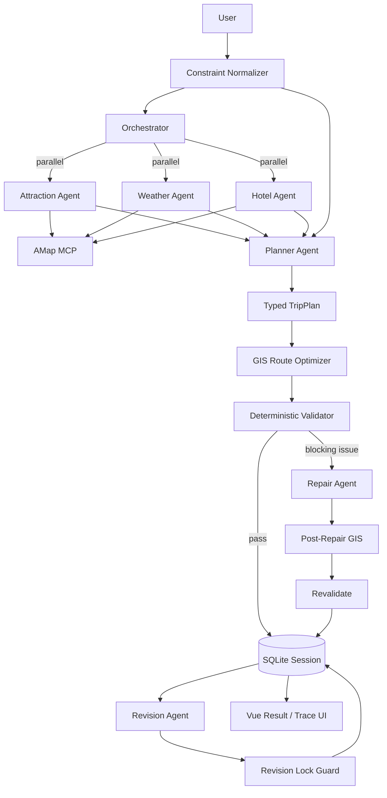

# Multi-Agent Trip Planner

一个面向真实旅行规划场景的 **Multi-Agent AI Application**。

项目不是让大模型直接生成旅行文案，而是让 Agent 在 **真实工具、空间数据、硬约束、确定性规则和反馈闭环** 下完成旅行规划。

基于 **HelloAgents + MCP + FastAPI + Vue 3 + AMap GIS**，覆盖多 Agent 编排、真实工具调用、GIS 路线优化、约束校验、自动修正、会话持久化、局部修改保护、Execution Trace 与 Agent Eval。

## Why This Project

一个旅行计划同时包含两类问题：

```text
语义问题：去哪里、怎么玩、用户喜欢什么
确定性问题：预算是否超标、路线是否合理、已确认内容能不能被改
```

因此本项目没有把所有事情都交给 LLM：

```text
LLM       → 理解意图、选择内容、生成/修正计划
MCP       → 获取真实 POI / 天气 / 路线数据
GIS       → 计算空间成本并优化访问顺序
Validator → 检查明确可计算的硬约束
Lock Guard→ 保护用户已经确认的内容
Trace     → 解释系统执行过程
Eval      → 衡量系统是否真的工作
```

## Core Workflow



自动 Repair 最多执行一次，避免 Agent 在生成与审查之间无限循环。

## Highlights

### Multi-Agent Orchestration

Attraction / Weather / Hotel Agent 并行检索，完成后 fan-in 到 Planner。每个请求创建独立 Agent 上下文，避免历史消息跨用户或跨 Eval case 污染。

### Real MCP Tool Calling

通过高德地图 MCP 获取 POI、天气和路线信息。工具失败会进入统一错误分类、有限重试和显式 fallback，不伪造成功结果。

### Structured Constraints

支持把明确要求转换成硬约束，例如：

```text
总预算不超过 2500 元
每天最多 3 个景点
每天游览最多 6 小时
单段交通不要超过 45 分钟
```

这些约束不仅进入 Prompt，还会被后端 Validator 再次检查。

### GIS Route Optimizer

Planner 决定“去哪些地方”，GIS 层决定“按什么顺序去”。

```text
POI coordinates
      ↓
Directed Cost Matrix
 ├─ AMap route time
 └─ Haversine fallback
      ↓
Route Search
      ↓
Lower-cost visit order
```

对常见的每日 2–3 个景点直接枚举候选访问顺序，选择交通总成本更低的方案，并记录优化前后时间与数据来源。

### Validate → Repair → Revalidate

Validator 当前检查：

- 行程天数
- 总预算
- 每日景点数量
- 每日游览时长
- 重复景点
- 相邻景点交通时间
- 路线数据真实来源 / fallback 状态

存在 blocking issue 时触发一次最小范围 Repair，之后重新进行 GIS 优化与校验。如果仍未解决，结果标记为 degraded，而不是假装完全成功。

### Persistent Revision Locks

支持：

```text
第一天和酒店已经确定，不要改，把第三天改轻松一点。
```

锁定状态可以覆盖指定日期、全部酒店和指定景点，并持久化到 Session。

Revision Agent 会先收到锁定要求；随后 Deterministic Lock Guard 再比较修改前后数据。即使模型误改锁定内容，后端也会恢复原值并把 violation 写入 Trace。

### Execution Trace

Trace 页面可以展示：

```text
Attraction / Weather / Hotel
        ↓
Planner
        ↓
GIS Route Optimizer
        ↓
Validator
        ↓
Repair (if needed)
        ↓
Post-Repair GIS / Validator
```

并记录 latency、attempts、retry、error category、route source、GIS before/after、validation issues、lock violations 和 degraded state。

### Agent Eval + CI

离线 CI 自动执行：

- Python compile
- pytest unit tests
- Vue / TypeScript build

真实 Agent Eval 可以衡量：

```text
case_pass_rate
structured_output_success_rate
retrieval_agent_success_rate
validation_pass_rate
repair_success_rate
fallback_rate
agent_step_retry_rate
average_latency_ms
p95_latency_ms
```

仓库不预填虚构指标；只有真实 LLM + AMap 环境跑出的结果才应该用于 README 或简历。

## Tech Stack

**Agent / Backend**

- Python
- HelloAgents / SimpleAgent
- MCPTool / Model Context Protocol
- AMap MCP
- FastAPI / Pydantic
- SQLite
- GIS / Haversine distance
- exact route permutation search
- ThreadPoolExecutor
- pytest

**Frontend**

- Vue 3
- TypeScript
- Vue Router
- Vite
- Ant Design Vue
- AMap JavaScript API

## Project Structure

```text
multi-agent-trip-planner/
├── backend/
│   ├── app/
│   │   ├── agents/
│   │   ├── api/routes/
│   │   ├── models/
│   │   └── services/
│   │       ├── orchestration_service.py
│   │       ├── constraint_service.py
│   │       ├── gis_optimizer_service.py
│   │       ├── route_service.py
│   │       ├── validation_service.py
│   │       ├── revision_lock_service.py
│   │       ├── resilience_service.py
│   │       └── session_service.py
│   ├── evals/
│   └── tests/
├── frontend/
│   └── src/views/
│       ├── Home.vue
│       ├── Result.vue
│       └── Trace.vue
├── docs/
│   ├── ARCHITECTURE.md
│   ├── EVALUATION.md
│   └── ROADMAP.md
└── .github/workflows/
    ├── ci.yml
    └── live-eval.yml
```

## Quick Start

### Backend

```bash
cd backend
python -m venv venv
source venv/bin/activate
pip install -r requirements.txt
cp .env.example .env
uvicorn app.api.main:app --reload --host 0.0.0.0 --port 8000
```

### Frontend

```bash
cd frontend
npm install
cp .env.example .env
npm run dev
```

## Evaluation

本地运行完整 Eval：

```bash
cd backend
python -m evals.run_eval
```

只跑前三条：

```bash
python -m evals.run_eval --limit 3
```

GitHub Actions 中还提供 `Live Agent Eval` 工作流。真实评估需要配置模型和高德相关 Actions Secrets；缺少密钥时会明确跳过 live case，不会把 mock/空跑当成真实指标。

## Documentation

- [Architecture](docs/ARCHITECTURE.md) — Agent 分工、GIS、Validator、Repair、Locks、Reliability 与架构取舍
- [Evaluation & Testing](docs/EVALUATION.md) — 离线测试、Live Eval、指标定义和结果使用原则
- [Roadmap](docs/ROADMAP.md) — 当前完成度与后续优先级

## Current Status

核心 Agent 功能已经形成闭环：

```text
User Constraints
→ Multi-Agent Retrieval
→ Planner
→ GIS Optimization
→ Deterministic Validation
→ Automatic Repair
→ Revalidation
→ Persistent Session
→ Revision Locks
→ Execution Trace
→ Eval
```

离线 Backend / Frontend CI 已可稳定验证代码；下一阶段重点不是继续增加 Agent 或 UI 协议，而是配置真实环境跑 Live Eval，建立可重复基线，再针对真实 failure cases 优化。

## Design Boundary

当前没有引入 A2UI。原因是旅行结果页面结构稳定，动态的是业务数据而不是 UI schema；Typed TripPlan + deterministic Vue rendering 更简单、更容易测试。

如果未来产品演进成通用 Travel Agent Workspace，需要 Agent 在比较表、审批表单、预算编辑器、动态任务面板等不同交互 Surface 间动态选择，再重新评估 A2UI。

---

**Project focus:** Agent Engineering · MCP Tool Calling · GIS Optimization · Deterministic Validation · Reliability · Observability · Evaluation