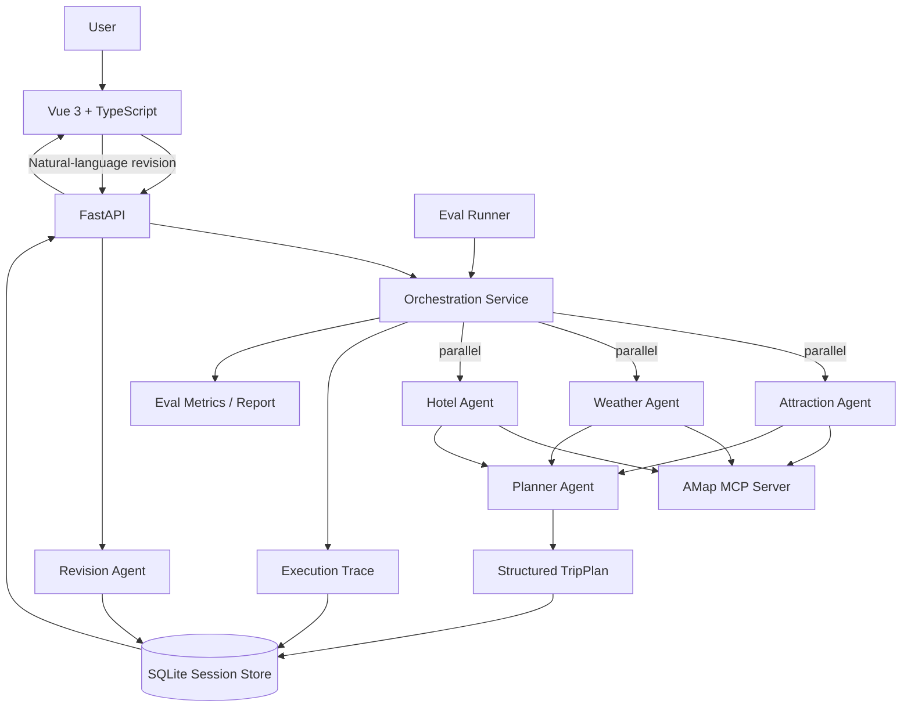

# Multi-Agent Trip Planner

一个面向真实旅行规划场景的 **多智能体（Multi-Agent）AI 应用**。

项目使用 HelloAgents 构建多个专职 Agent，通过 **MCP（Model Context Protocol）** 接入高德地图能力，并以 FastAPI + Vue 3 完成任务编排、真实工具调用、结构化结果生成、会话持久化、自然语言修订、执行追踪和可重复评估。

> 项目的重点不是“让大模型写一段旅行文案”，而是把 **Agent Orchestration、Tool Calling、Structured Output、Reliability、State Persistence、Observability 与 Evaluation** 组合成一个可运行、可检查、可持续迭代的 Agent System。

## Highlights

- **Multi-Agent Decomposition**：景点、天气、酒店、行程规划分别由专职 Agent 处理
- **Parallel Orchestration**：三个检索型 Agent 采用 fan-out / fan-in 并行任务编排
- **MCP Tool Calling**：通过高德地图 MCP 获取 POI、天气和路线等外部信息
- **Structured Output**：Planner Agent 输出受 Pydantic 模型约束的 TripPlan
- **Reliability Policy**：统一异常分类、有限重试与退避策略，并把重试过程写入 Trace
- **Persistent Session**：使用 SQLite 保存当前行程、历史版本和执行轨迹
- **Natural-language Revision**：用户可基于 session_id 继续用自然语言局部修改行程
- **Agent Observability**：独立 Execution Trace 页面展示 Agent、Tool、Status、Latency、Retry 与错误类别
- **Deterministic Agent Eval**：固定测试集评估结构化输出、工具执行、fallback、约束满足与延迟

## Architecture



## Agent Workflow

一次旅行规划请求会经历：

```text
User Request
    ↓
FastAPI
    ↓
Orchestrator
    ├── Attraction Agent ── MCP / AMap ─┐
    ├── Weather Agent ───── MCP / AMap ─┼── parallel
    └── Hotel Agent ─────── MCP / AMap ─┘
                    ↓ fan-in
               Planner Agent
                    ↓
             Structured TripPlan
                    ↓
        SQLite Session + Execution Trace
                    ↓
            Vue Result / Trace UI
```

Attraction、Weather、Hotel 三个任务之间没有直接数据依赖，因此由 `ThreadPoolExecutor` 并发调度；Planner Agent 等待三类结果汇合后再生成最终结构化行程。

## Reliability Policy

Agent 系统的失败不能只靠 `try/except` 吞掉，因此项目增加了一层统一可靠性策略。

### Error classification

当前把异常归一成少量稳定类别：

```text
timeout
rate_limit
network
auth
validation
agent_error
```

### Retry strategy

默认配置：

```env
LLM_TIMEOUT=120
AGENT_MAX_RETRIES=2
AGENT_RETRY_BACKOFF_SECONDS=0.5
```

其中：

- 网络、限流、超时和未分类 Agent 错误可重试
- 认证错误不会重试
- 普通检索 Agent 的本地 validation 错误不会盲目重试
- Planner 如果生成非法 JSON / 不符合 TripPlan，则允许重新生成；所有尝试失败后才进入 fallback

`AGENT_MAX_RETRIES=2` 表示首次调用失败后最多再尝试 2 次。

模型请求的实际超时继续由 LLM Provider / `LLM_TIMEOUT` 负责；项目没有用无法安全终止的后台线程伪造“强制超时”。

## Agent Execution Trace

每个步骤都会记录统一执行事件：

```json
{
  "agent": "Weather Agent",
  "task": "查询目的地天气",
  "tool": "amap_maps_weather",
  "status": "success",
  "duration_ms": 1264.42,
  "attempts": 2,
  "error_category": null,
  "retry_errors": [
    {
      "attempt": 1,
      "category": "network",
      "message": "...",
      "retryable": true
    }
  ]
}
```

前端 `/trace` 页面可以观察：

- 三个并行检索 Agent
- Planner 汇总节点
- Agent 状态
- MCP Tool 名称
- 单步 / 总编排耗时
- 尝试次数与 Retry history
- 错误类别
- failed / fallback / degraded 信息
- 简短结果预览

这让项目不仅能“运行 Agent”，也能解释 Agent 为什么成功、为什么失败，以及系统是否发生过降级。

## Persistent Session & Revision

首次生成计划后，后端会创建 `session_id`，并把以下数据持久化到 SQLite：

```text
session_id
current_plan
history
execution_trace
created_at
updated_at
```

用户可以继续输入：

```text
把第二天上午的博物馆换成一个适合拍照的公园，其他安排不变。
```

Revision Agent 会基于当前 TripPlan 做局部调整；旧版本会进入 `history`，新的 Revision Trace 也会追加到当前 Session。

因此服务重启后，会话不再因为 Python 进程内存清空而直接丢失。

## Agent Eval

项目包含一套 **不依赖 LLM-as-a-Judge 的确定性 Eval**。

默认测试集覆盖北京、上海、广州、成都、西安、杭州、南京、深圳等不同旅行场景，并在运行时根据当天日期生成实际旅行日期。

### What is measured

每个 case 会检查：

- 目的地是否与请求一致
- 行程天数是否正确
- `day_index` 是否连续
- 每天是否达到最少景点数量
- 是否包含早餐 / 午餐 / 晚餐
- 经纬度是否在合法范围
- 天气信息是否覆盖旅行天数
- 是否生成预算
- 预算分项与总额是否一致
- Attraction / Weather / Hotel Agent 是否全部成功
- Planner 是否成功生成结构化 TripPlan
- 是否使用 fallback

最终聚合：

```text
case_pass_rate
average_check_score
structured_output_success_rate
retrieval_agent_success_rate
fallback_rate
agent_step_retry_rate
average_latency_ms
p95_latency_ms
error_categories
```

### Run eval

在 `backend/` 目录执行：

```bash
python -m evals.run_eval
```

只跑前三条：

```bash
python -m evals.run_eval --limit 3
```

只跑一个场景：

```bash
python -m evals.run_eval --case beijing-culture-3d
```

未来接入 CI 时可以设置质量门槛：

```bash
python -m evals.run_eval --min-pass-rate 0.8
```

默认报告写入：

```text
backend/evals/reports/latest.json
```

生成的报告不会提交进 Git。README 不预填任何“漂亮指标”；只有在真实环境跑完 Eval 后，才应该把实际数据写入简历或项目说明。

## Tech Stack

### Agent / Backend

- Python
- HelloAgents / SimpleAgent
- MCPTool / Model Context Protocol
- AMap MCP Server
- FastAPI
- Pydantic
- SQLite
- `concurrent.futures.ThreadPoolExecutor`
- 可配置 LLM Provider / Model

### Frontend

- Vue 3
- TypeScript
- Vue Router
- Vite
- Ant Design Vue
- Axios
- AMap JavaScript API
- html2canvas / jsPDF

## Project Structure

```text
multi-agent-trip-planner/
├── backend/
│   ├── app/
│   │   ├── agents/
│   │   │   └── trip_planner_agent.py
│   │   ├── api/
│   │   │   └── routes/
│   │   │       ├── trip.py
│   │   │       ├── map.py
│   │   │       └── poi.py
│   │   ├── models/
│   │   │   └── schemas.py
│   │   └── services/
│   │       ├── orchestration_service.py  # fan-out / fan-in + Trace
│   │       ├── resilience_service.py     # retry / error classification
│   │       ├── session_service.py        # SQLite session persistence
│   │       ├── amap_service.py
│   │       ├── llm_service.py
│   │       └── unsplash_service.py
│   ├── evals/
│   │   ├── cases.json                    # baseline Eval Dataset
│   │   └── run_eval.py                   # deterministic Eval Runner
│   ├── requirements.txt
│   └── run.py
├── frontend/
│   ├── src/
│   │   ├── services/
│   │   ├── types/
│   │   └── views/
│   │       ├── Home.vue
│   │       ├── Result.vue
│   │       └── Trace.vue                 # Agent Execution Trace
│   └── package.json
└── README.md
```

## Quick Start

### Requirements

- Python 3.10+
- Node.js 16+
- AMap API Key
- 一个兼容 HelloAgents 的 LLM API 配置

### Backend

```bash
cd backend
python -m venv venv
source venv/bin/activate
pip install -r requirements.txt
cp .env.example .env
uvicorn app.api.main:app --reload --host 0.0.0.0 --port 8000
```

FastAPI Docs：

```text
http://localhost:8000/docs
```

### Frontend

```bash
cd frontend
npm install
cp .env.example .env
npm run dev
```

默认访问：

```text
http://localhost:5173
```

生成一次旅行计划后，可以从顶部导航进入：

```text
http://localhost:5173/trace
```

查看当前 Session 的 Agent Execution Trace。

## Core APIs

### Generate Trip Plan

```http
POST /api/trip/plan
```

返回：

```text
session_id + TripPlan + execution_trace
```

### Revise Trip Plan

```http
POST /api/trip/revise
```

```json
{
  "session_id": "<session-id>",
  "feedback": "把第二天上午的景点换成适合拍照的公园，其他安排不变"
}
```

### Read Persistent Session

```http
GET /api/trip/session/{session_id}
```

### Read Execution Trace

```http
GET /api/trip/trace/{session_id}
```

## Engineering Decisions

### Why separate Orchestrator from Agent implementation?

`trip_planner_agent.py` 关注单个 Agent 的能力与 Prompt；`orchestration_service.py` 负责：

- 任务依赖关系
- 并行调度
- fan-out / fan-in
- 错误隔离
- retry policy
- latency 统计
- execution trace

这样后续增加 Coordinator、DAG 或异步任务队列时，不需要把调度逻辑继续堆进 Agent 类。

### Why deterministic Eval before LLM-as-a-Judge?

当前优先评估能够明确判断对错的工程指标，例如 JSON 是否有效、任务是否完成、工具步骤是否成功、行程结构是否满足约束以及 fallback 是否发生。

这些指标：

- 可以重复运行
- 容易解释
- 不再额外依赖另一个模型
- 适合作为回归测试与 CI Gate

主观的“旅行计划质量”未来可以再增加 rubric / LLM judge，但不替代这层基础工程 Eval。

### Why SQLite first?

当前项目是单机作品集应用，SQLite 能以很低复杂度解决“进程重启后 Session 丢失”的核心问题，同时保持数据模型清晰。

如果进一步部署为多实例服务，可以把 Session Store 替换为 PostgreSQL / Redis，而上层 API 和 Agent 工作流不需要大改。

### Why not A2UI now?

当前 TripPlan 的主要展示结构是稳定的：行程、天气、酒店、预算、地图和每日安排。这里的变化主要是 **业务数据动态**，而不是 **UI 结构动态**。

因此当前选择：

```text
Typed TripPlan
    ↓
Deterministic Vue Components
```

而不是为了技术栈数量强行增加动态 UI 协议。

只有当项目进一步演进成通用 Travel Agent Workspace，同一个 Agent 会根据不同任务动态产生比较表、审批表单、选择器、预算编辑器等完全不同 Surface 时，再引入 A2UI 才更有明确收益。

## Current Boundaries

当前仍有这些明确的工程化空间：

- Agent 路由仍是固定任务图，还不是动态 Coordinator / Router
- Trace 已包含 Agent / Tool / latency / retry / error category，但还没有 token usage 与完整 LLM span
- 当前 retry 是 Agent step 级别；MCP 工具层还没有独立 circuit breaker
- Tool Calling 仍依赖当前 HelloAgents / Prompt 约定，后续可进一步升级为更严格的 typed tool schema
- Session Store 使用 SQLite，暂未面向多实例并发部署
- Eval 当前以确定性规则为主，还没有人工 rubric / semantic judge
- 尚未加入 CI、容器化部署和生产级日志体系

## Roadmap

- [x] Multi-Agent 任务拆分
- [x] MCP Tool Calling
- [x] Structured TripPlan
- [x] 自然语言行程修订
- [x] 并行 fan-out / fan-in Agent Orchestration
- [x] SQLite Session Persistence
- [x] Agent Execution Trace API
- [x] Execution Trace 可视化页面
- [x] Agent retry / backoff / error classification
- [x] Deterministic Agent Eval Dataset + metrics
- [ ] Coordinator / Router 动态任务选择
- [ ] typed tool schema / stricter tool validation
- [ ] tool-level circuit breaker
- [ ] token usage / model span tracing
- [ ] automated tests + CI Eval Gate
- [ ] Docker / deployment
- [ ] semantic rubric / human evaluation

## Why This Project

相比普通 LLM Chat Demo，本项目主要验证这些 Agent Engineering 问题：

- 如何把复杂业务目标拆成多个 Agent 任务
- 哪些任务可以并行，哪些任务存在数据依赖
- 如何让 Agent 通过 MCP 使用真实外部工具
- 如何把模型结果约束成前端可消费的结构化数据
- 如何处理网络、限流、格式错误和 fallback
- 如何维护跨多轮交互的任务状态和历史版本
- 如何让 Agent 执行过程可观察、可调试、可解释
- 如何用可重复 Eval 证明系统质量，而不是凭 Demo 观感判断
- 如何把上述能力整合进一个真正可运行的全栈产品

因此它既是旅行规划应用，也是一个 **Multi-Agent + MCP + Orchestration + Reliability + Observability + Evaluation + Full-stack AI Application** 的工程实践。

## License

CC BY-NC-SA 4.0

## Acknowledgements

- [Hello-Agents](https://github.com/datawhalechina/Hello-Agents)
- [HelloAgents](https://github.com/jjyaoao/HelloAgents)
- [高德地图开放平台](https://lbs.amap.com/)
- [amap-mcp-server](https://github.com/sugarforever/amap-mcp-server)
