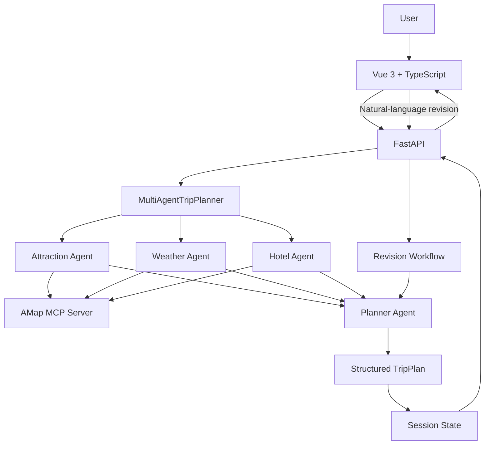

# Multi-Agent Trip Planner

一个面向真实旅行规划场景的 **多智能体（Multi-Agent）旅行规划系统**。

项目基于 HelloAgents 构建多个专职 Agent，通过 **MCP（Model Context Protocol）** 接入高德地图能力，并使用 FastAPI + Vue 3 完成从用户需求、Agent 工具调用、结构化行程生成，到自然语言二次修改与地图展示的完整闭环。

> 这个项目的重点不是“让大模型生成一段旅行文案”，而是探索如何把 **Agent 编排、外部工具调用、结构化输出、会话状态和前后端交互** 组合成一个可运行的 AI 应用。

## 核心能力

### 1. 多 Agent 协作

系统将旅行规划拆分为多个职责明确的 Agent：

- **Attraction Agent**：根据目的地和用户偏好搜索景点
- **Weather Agent**：获取目的地天气信息
- **Hotel Agent**：搜索并推荐住宿
- **Planner Agent**：整合景点、天气、酒店等结果，生成完整行程

各 Agent 共享同一套地图工具能力，由 `MultiAgentTripPlanner` 统一组织执行流程。

### 2. MCP 工具调用

通过 `MCPTool` 接入高德地图 MCP Server，让 Agent 可以调用真实外部能力，而不是仅依赖模型内部知识。

当前包括：

- POI / 景点搜索
- 天气查询
- 酒店搜索
- 步行路线规划
- 驾车路线规划
- 公共交通路线规划

在景点、天气和酒店 Agent 的 Prompt 中明确要求优先使用工具结果，降低模型直接编造实时信息的风险。

### 3. 结构化行程生成

Planner Agent 将多个 Agent 的结果整合为统一的结构化 Trip Plan，包括：

- 每日行程
- 景点与坐标
- 酒店信息
- 交通方式
- 天气
- 餐饮建议
- 预算估算

后端通过 Pydantic 数据模型约束 API 输入与输出，前端不需要解析不可控的自然语言文本即可渲染结果。

### 4. 基于 Session 的自然语言修改

首次生成行程后，后端会创建 `session_id` 并保存当前计划。

用户可以继续输入自然语言，例如：

```text
把第二天的博物馆换成公园，其他行程保持不变。
```

系统会读取当前计划，由 Agent 对指定部分进行修改，再更新当前 Session 中保存的行程。

这使应用从“一次性生成”扩展为可持续调整的 **Agent 会话式工作流**。

### 5. 完整全栈应用

前端使用 Vue 3 + TypeScript，实现旅行信息输入、行程展示和地图交互；后端使用 FastAPI 提供 Agent 调用和地图相关 API。

项目覆盖：

```text
用户输入
   ↓
Vue 3 / TypeScript
   ↓
FastAPI
   ↓
MultiAgentTripPlanner
   ├── Attraction Agent ─┐
   ├── Weather Agent ────┼── MCP ── 高德地图服务
   └── Hotel Agent ──────┘
             ↓
        Planner Agent
             ↓
      Structured TripPlan
             ↓
      Session / FastAPI
             ↓
       前端地图与行程展示
```

## 系统架构



## 一次请求的执行流程

1. 用户填写目的地、日期、住宿方式和旅行偏好。
2. Attraction Agent 调用地图工具搜索符合偏好的真实 POI。
3. Weather Agent 调用天气工具获取目的地天气信息。
4. Hotel Agent 搜索住宿候选项。
5. Planner Agent 将多个 Agent 返回的信息整合成结构化旅行计划。
6. 后端将计划保存到 Session，并把 `session_id + TripPlan` 返回前端。
7. 用户可以继续通过自然语言提出局部修改。
8. Revision Workflow 根据当前计划和用户反馈生成新的 TripPlan。

## 技术栈

### Agent / Backend

- Python
- HelloAgents
- SimpleAgent
- MCPTool / Model Context Protocol
- AMap MCP Server
- FastAPI
- Pydantic
- 可配置 LLM Provider / Model

### Frontend

- Vue 3
- TypeScript
- Vite
- Ant Design Vue
- Axios
- 高德地图 JavaScript API
- html2canvas / jsPDF

## 项目结构

```text
multi-agent-trip-planner/
├── backend/
│   ├── app/
│   │   ├── agents/
│   │   │   └── trip_planner_agent.py   # 多 Agent 定义与编排
│   │   ├── api/
│   │   │   ├── main.py
│   │   │   └── routes/
│   │   │       ├── trip.py             # 行程生成 / 修改接口
│   │   │       ├── map.py
│   │   │       └── poi.py
│   │   ├── models/
│   │   │   └── schemas.py              # 结构化数据模型
│   │   ├── services/
│   │   │   ├── amap_service.py
│   │   │   ├── llm_service.py
│   │   │   ├── session_service.py
│   │   │   └── unsplash_service.py
│   │   └── config.py
│   ├── requirements.txt
│   └── run.py
├── frontend/
│   ├── src/
│   │   ├── services/
│   │   ├── types/
│   │   └── views/
│   │       ├── Home.vue
│   │       └── Result.vue
│   └── package.json
└── README.md
```

## 快速开始

### 环境要求

- Python 3.10+
- Node.js 16+
- 高德地图 API Key
- 一个兼容 HelloAgents 的 LLM API 配置

### 1. 启动后端

```bash
cd backend
python -m venv venv
source venv/bin/activate
pip install -r requirements.txt
cp .env.example .env
```

在 `.env` 中配置 LLM 和高德地图相关 Key，然后运行：

```bash
uvicorn app.api.main:app --reload --host 0.0.0.0 --port 8000
```

FastAPI 文档：

```text
http://localhost:8000/docs
```

### 2. 启动前端

```bash
cd frontend
npm install
cp .env.example .env
npm run dev
```

默认访问：

```text
http://localhost:5173
```

## 核心 API

### 创建旅行计划

```http
POST /api/trip/plan
```

返回旅行计划和本次会话对应的 `session_id`。

### 修改已有旅行计划

```http
POST /api/trip/revise
```

示例请求：

```json
{
  "session_id": "<session-id>",
  "feedback": "把第二天上午的景点换成适合拍照的公园，其他安排不变"
}
```

## 当前实现边界

这个版本以验证 Agent 工作流为主要目标，因此仍保留了一些明确的工程化改进空间：

- 多个专业 Agent 当前由固定流程顺序调用，还没有动态任务路由或 DAG 调度
- Session 当前保存在进程内存中，服务重启后不会持久化
- Agent 调用过程缺少完整的 tracing / token / latency 可观测能力
- 尚未建立系统化的 Agent Eval 与回归测试集
- 工具调用异常、模型异常和超时策略仍可以进一步统一

这些限制也是后续将 Demo 演进为更完整 Agent System 的重点。

## Roadmap

- [ ] 将景点、天气、酒店查询改造成可并行执行的任务节点
- [ ] 增加 Coordinator / Router，按任务动态选择 Agent 与工具
- [ ] 使用 Redis / Database 持久化 Session 和执行记录
- [ ] 增加 Agent Execution Trace，展示每一步模型与工具调用
- [ ] 增加工具调用超时、重试、降级与统一错误模型
- [ ] 建立旅行规划 Eval Dataset，评估工具正确率与结构化输出稳定性
- [ ] 增加自动化测试和 CI
- [ ] Docker 化前后端服务并补充部署方案

## 项目价值

相比普通的 LLM Chat Demo，本项目更关注 Agent 应用工程中的几个核心问题：

- 如何把复杂任务拆分给不同 Agent
- 如何让 Agent 使用真实外部工具获取信息
- 如何约束模型输出为前端可消费的数据结构
- 如何维护多轮任务中的业务状态
- 如何把 Agent 能力集成进一个真正可交互的全栈应用

因此，这个项目既可以作为旅行规划应用，也可以作为 **Multi-Agent + MCP + Full-stack AI Application** 的工程实践。

## License

CC BY-NC-SA 4.0

## Acknowledgements

- [Hello-Agents](https://github.com/datawhalechina/Hello-Agents)
- [HelloAgents](https://github.com/jjyaoao/HelloAgents)
- [高德地图开放平台](https://lbs.amap.com/)
- [amap-mcp-server](https://github.com/sugarforever/amap-mcp-server)
