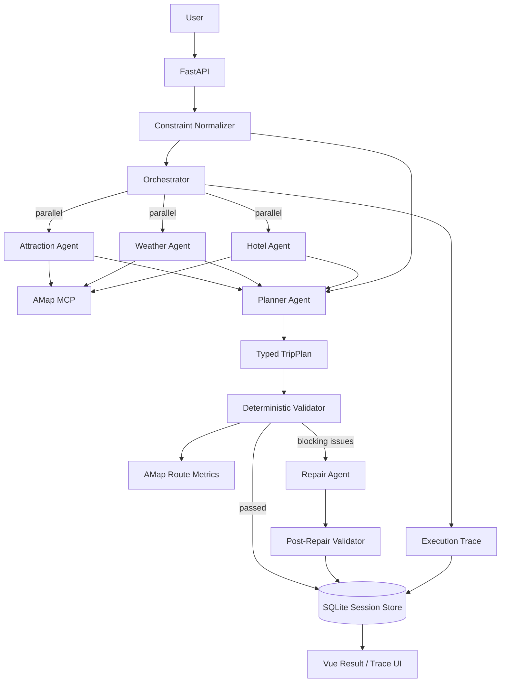

# Multi-Agent Trip Planner

一个面向真实旅行规划场景的 **Multi-Agent AI Application**。

项目基于 HelloAgents 构建专职 Agent，通过 **MCP（Model Context Protocol）** 接入高德地图能力，并使用 FastAPI + Vue 3 完成任务编排、真实工具调用、结构化输出、会话持久化、可靠性处理、执行追踪和 Agent Eval。

> 重点不是“让大模型生成一段旅行文案”，而是让 Agent 在 **真实工具、硬约束、确定性校验和反馈修正闭环** 下完成旅行规划任务。

## Highlights

- **Multi-Agent Decomposition**：Attraction / Weather / Hotel / Planner 职责拆分
- **Parallel Orchestration**：检索 Agent 使用 fan-out / fan-in 并行执行
- **MCP Tool Calling**：通过高德地图 MCP 获取 POI、天气和路线数据
- **Structured Constraints**：预算、每日景点数、游览时长、单段交通时长转为硬约束
- **Natural-language Constraint Extraction**：支持“预算 2000 元以内”“每天最多 2 个景点”等自然语言要求
- **Deterministic Trip Validator**：检查预算、每日强度、重复景点、路线耗时等可明确判断的问题
- **Validate → Repair → Revalidate**：初稿不合格时触发一次最小自动修正，并再次校验
- **Route-aware Validation**：优先使用高德 MCP 路线耗时，失败时退化为坐标距离估算并显式标记来源
- **Reliability Policy**：异常分类、有限重试、退避与显式 fallback
- **Request-scoped Agents**：避免 SimpleAgent history 跨请求污染
- **Persistent Session**：SQLite 保存计划、历史版本和 Execution Trace
- **Observability**：Trace 页面展示 Agent / Tool / Retry / Validator / Repair / Latency
- **Deterministic Eval**：衡量生成成功率、工具成功率、验证通过率、修正成功率和延迟
- **CI**：自动执行 Python compile、单元测试和 Vue/TypeScript build

## Architecture



## Planning Workflow

```text
User Request
    ↓
Constraint Normalizer
    ↓
Orchestrator
    ├── Attraction Agent ── AMap MCP ─┐
    ├── Weather Agent ───── AMap MCP ─┼── parallel
    └── Hotel Agent ─────── AMap MCP ─┘
                    ↓ fan-in
               Planner Agent
                    ↓
               Typed TripPlan
                    ↓
              Trip Validator
        ┌───────────┴───────────┐
      passed                blocking issues
        ↓                         ↓
   Final Plan                Repair Agent
                                  ↓
                         Post-Repair Validator
                                  ↓
                              Final Plan
```

自动 Repair 最多执行一次，避免 Agent 在“生成 → 校验 → 重写”之间无限循环。

## Structured Constraints

API 可以直接传递结构化约束：

```json
{
  "city": "北京",
  "start_date": "2026-10-01",
  "end_date": "2026-10-03",
  "travel_days": 3,
  "transportation": "公共交通",
  "accommodation": "舒适型酒店",
  "preferences": ["历史文化", "美食"],
  "constraints": {
    "max_budget": 2500,
    "max_daily_attractions": 3,
    "max_daily_visit_minutes": 480,
    "max_route_minutes": 60
  }
}
```

普通用户不需要理解这个结构，也可以直接写：

```text
总预算控制在 2500 元以内，每天最多 3 个景点，单段交通不要超过 45 分钟。
```

后端只提取能明确量化的要求，不会把模糊偏好强行转换成硬约束。

## Deterministic Validator

Validator 当前检查：

- 行程天数与请求是否一致
- 总预算是否超过上限
- 每天景点数量是否过多
- 每日景点游览总时长是否过高
- 是否重复安排同一景点
- 相邻景点的交通耗时是否超过限制
- 路线数据来自真实 AMap MCP 还是坐标估算 fallback

例如：

```json
{
  "code": "route_leg_too_long",
  "severity": "error",
  "message": "第 2 天“景点A → 景点B”预计交通约 86 分钟，超过单段上限 60 分钟。",
  "details": {
    "route_minutes": 86,
    "source": "amap_mcp"
  }
}
```

与单纯让 LLM “自己检查一下”不同，这些规则可以重复执行、自动测试，也可以进入 Eval。

## Route-aware Validation

相邻景点路线优先使用高德 MCP：

```text
maps_direction_walking_by_address
maps_direction_driving_by_address
maps_direction_transit_integrated_by_address
```

如果 MCP 路线不可用，Validator 不会假装拿到了真实路线，而会：

1. 根据景点经纬度计算直线距离；
2. 按交通方式做保守时间估算；
3. 在 Trace 中把数据源记录为 `coordinate_estimate`。

真实路线成功时则记录：

```text
source = amap_mcp
```

## Validate → Repair → Revalidate

Planner 初稿出现硬冲突时，Repair Agent 会获得：

```text
当前 TripPlan
+ Structured Constraints
+ Validator Blocking Issues
```

Repair Prompt 明确要求 **最小范围修改**，而不是重新自由规划整个行程。

修正后再次执行 Validator。如果仍然不通过，Orchestrator 会标记：

```text
status = degraded
validation_passed = false
```

系统不会把未解决的冲突伪装成完全成功。

## Reliability

统一异常类别：

```text
timeout
rate_limit
network
auth
validation
agent_error
```

默认：

```env
AGENT_MAX_RETRIES=2
AGENT_RETRY_BACKOFF_SECONDS=0.5
```

- timeout / network / rate limit：允许有限重试
- auth：不重试
- Planner JSON / Pydantic validation：允许重新生成
- 所有尝试耗尽后才进入 fallback

Fallback 不会伪造景点、天气或坐标，而是返回明确的降级结果。

## Execution Trace

前端 `/trace` 页面可以看到：

```text
Attraction Agent ┐
Weather Agent    ├── parallel
Hotel Agent      ┘
       ↓
Planner Agent
       ↓
Trip Validator
       ↓ (if needed)
Repair Agent
       ↓
Post-Repair Validator
       ↓
Orchestrator
```

每个事件可包含：

```text
status
latency
attempts
retry history
error category
tool name
validation issues
route source
degraded state
```

## Agent Eval

运行：

```bash
cd backend
python -m evals.run_eval
```

只跑前三条：

```bash
python -m evals.run_eval --limit 3
```

当前聚合指标包括：

```text
case_pass_rate
average_check_score
structured_output_success_rate
retrieval_agent_success_rate
validation_pass_rate
repair_trigger_rate
repair_success_rate
fallback_rate
agent_step_retry_rate
average_latency_ms
p95_latency_ms
```

README 不预填任何虚构成绩；只有真实环境完成 Eval 后才应该把指标写进简历。

## Persistent Session

SQLite 保存：

```text
session_id
current_plan
history
execution_trace
created_at
updated_at
```

用户可以继续输入：

```text
把第二天上午的博物馆换成一个适合拍照的公园，其他安排不变。
```

旧版本进入 `history`，Revision Trace 追加到 Session。

## Tech Stack

### Agent / Backend

- Python
- HelloAgents / SimpleAgent
- MCPTool / Model Context Protocol
- AMap MCP Server
- FastAPI
- Pydantic
- SQLite
- ThreadPoolExecutor
- pytest

### Frontend

- Vue 3
- TypeScript
- Vue Router
- Vite
- Ant Design Vue
- AMap JavaScript API

## Project Structure

```text
multi-agent-trip-planner/
├── backend/
│   ├── app/
│   │   ├── agents/
│   │   │   └── trip_planner_agent.py
│   │   ├── api/routes/
│   │   │   └── trip.py
│   │   ├── models/
│   │   │   └── schemas.py
│   │   └── services/
│   │       ├── orchestration_service.py
│   │       ├── constraint_service.py
│   │       ├── validation_service.py
│   │       ├── route_service.py
│   │       ├── resilience_service.py
│   │       └── session_service.py
│   ├── evals/
│   │   ├── cases.json
│   │   └── run_eval.py
│   └── tests/
├── frontend/
│   └── src/views/
│       ├── Home.vue
│       ├── Result.vue
│       └── Trace.vue
└── .github/workflows/ci.yml
```

## Quick Start

Backend：

```bash
cd backend
python -m venv venv
source venv/bin/activate
pip install -r requirements.txt
cp .env.example .env
uvicorn app.api.main:app --reload --host 0.0.0.0 --port 8000
```

Frontend：

```bash
cd frontend
npm install
cp .env.example .env
npm run dev
```

## Engineering Decisions

### Why deterministic validation instead of another Reviewer LLM?

预算、数量、耗时、重复景点、路线时长等问题都有可明确判断的规则。

对于这些问题，确定性 Validator 比另一个 LLM 更：

- 可重复
- 可解释
- 可测试
- 可进入 CI / Eval
- 不增加额外 Judge 模型的不确定性

LLM 负责生成与修正，代码负责判断明确约束是否满足。

### Why only one automatic repair?

无限 Planner ↔ Reviewer 循环会增加成本、延迟和不可预测性。

当前策略是：

```text
Generate → Validate → one Repair → Revalidate
```

如果仍不通过，就显式 degraded，而不是继续无限调用模型。

### Why not A2UI now?

当前 UI 的核心结构稳定：行程、天气、酒店、预算、地图、Trace。

这里主要是 **业务数据动态**，不是 **UI 结构动态**，因此当前选择：

```text
Typed TripPlan
    ↓
Deterministic Vue Components
```

当项目未来演进成通用 Travel Agent Workspace，需要根据任务动态产生 Comparison Table、Approval Form、Budget Editor 等不同 Surface 时，再引入 A2UI 更合理。

## Current Boundaries

- Tool Calling 仍依赖当前 HelloAgents 的调用约定，后续可升级 typed/native tool calling
- Route MCP 输出存在版本差异，因此 route parser 保留 coordinate fallback
- Agent 路由仍是固定 DAG，不是动态 Coordinator
- Session Store 使用 SQLite，尚未面向多实例部署
- Eval 以确定性规则为主，尚未加入主观旅行体验 rubric
- Trace 尚未记录完整 token usage / LLM span
- Revision 流程后续还可以加入“锁定日期/酒店/景点”机制

## Roadmap

- [x] Multi-Agent decomposition
- [x] MCP tool calling
- [x] Parallel fan-out / fan-in orchestration
- [x] Structured TripPlan
- [x] Request-scoped Agent isolation
- [x] Retry / backoff / error classification
- [x] SQLite session persistence
- [x] Execution Trace UI
- [x] Deterministic Agent Eval
- [x] Structured constraints
- [x] Natural-language constraint extraction
- [x] Route-aware deterministic Validator
- [x] Validate → Repair → Revalidate loop
- [x] CI
- [ ] Typed / native tool calling
- [ ] Locked fields for revision
- [ ] Token / LLM span tracing
- [ ] Docker / deployment
- [ ] Dynamic Coordinator / Router

## License

CC BY-NC-SA 4.0

## Acknowledgements

- Hello-Agents
- HelloAgents
- 高德地图开放平台
- amap-mcp-server
