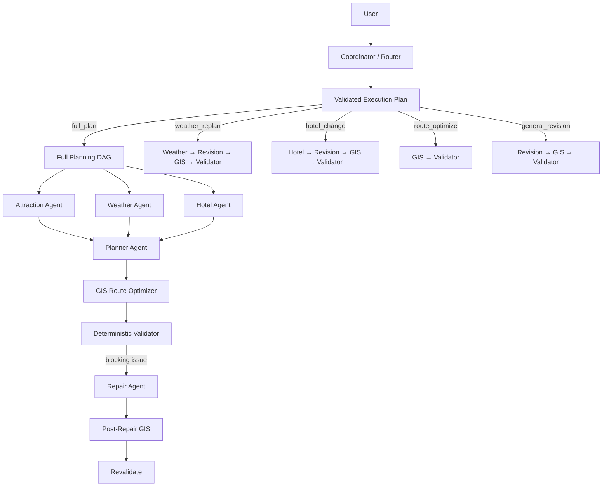

# Multi-Agent Trip Planner

一个面向真实旅行规划场景的 **Multi-Agent AI Application**。

项目不是让大模型直接生成旅行文案，而是让 Agent 在 **真实工具、空间数据、硬约束、确定性规则和反馈闭环** 下完成旅行规划。

基于 **HelloAgents + MCP + FastAPI + Vue 3 + AMap GIS**，覆盖动态任务路由、多 Agent 编排、真实工具调用、GIS 路线优化、约束校验、自动修正、会话持久化、局部修改保护、Execution Trace 与 Agent Eval。

## Why This Project

一个旅行计划同时包含三类问题：

```text
任务问题：这次用户到底想完整规划、改天气、换酒店，还是只优化路线？
语义问题：去哪里、怎么玩、用户喜欢什么？
确定性问题：预算是否超标、路线是否合理、已确认内容能不能被改？
```

因此本项目没有把所有事情都交给一个 LLM：

```text
Coordinator → 判断任务类型并选择能力
LLM         → 理解偏好、生成/修正计划
MCP         → 获取真实 POI / 天气 / 酒店 / 路线数据
GIS         → 计算空间成本并优化访问顺序
Validator   → 检查明确可计算的硬约束
Lock Guard  → 保护用户已经确认的内容
Trace       → 解释系统执行过程
Eval        → 衡量系统是否真的工作
```

## Dynamic Multi-Agent Workflow

系统不再让所有请求都走同一条固定链路。



完整规划仍然使用稳定的 fan-out / fan-in DAG；已有 Session 的后续任务由 Coordinator 选择更小的执行图。

例如：

```text
“明天下雨，把第二天改成室内”
→ Weather → Revision → GIS → Validator

“酒店换便宜一点”
→ Hotel → Revision → GIS → Validator

“这三个景点怎么排最省时间”
→ GIS → Validator

“第三天轻松一点”
→ Revision → GIS → Validator
```

### Coordinator 不是无限权限 Supervisor

Coordinator 可以判断 intent，并建议需要哪些 capability，但 **不能直接决定执行任意 Python 函数或工具**。

例如它可以输出：

```json
{
  "intent": "weather_replan",
  "requested_capabilities": ["weather", "revision", "gis", "validator"],
  "reason": "用户要求根据降雨调整已有行程"
}
```

后端随后把 intent 转换成预定义、白名单的 canonical graph。LLM 输出中的未知 capability、任意依赖边或函数名不会被直接执行。

设计原则是：

```text
LLM  → 判断“需要什么能力”
Code → 决定“允许怎么执行”
```

Coordinator LLM 不可用或输出无效时，会显式退化到 deterministic heuristic router，而不是让整个任务失败。

## Highlights

### Task-Aware Multi-Agent Orchestration

Attraction / Weather / Hotel Agent 在完整规划中并行检索，fan-in 到 Planner；后续任务则由 Coordinator 根据用户意图选择最小执行图，避免每次都重复调用所有 Agent。

每个请求创建独立 Agent 上下文，避免历史消息跨用户、Session 或 Eval case 污染。

### Real MCP Tool Calling

通过高德地图 MCP 获取 POI、天气、酒店和路线信息。工具失败会进入统一错误分类、有限重试和显式 fallback，不伪造成功结果。

### Structured Constraints

支持把明确要求转换成硬约束，例如：

```text
总预算不超过 2500 元
每天最多 3 个景点
每天游览最多 6 小时
单段交通不要超过 45 分钟
```

这些约束不仅进入 Prompt，还会被后端 Validator 再次检查。

### GIS Route Optimizer

Planner 决定“去哪些地方”，GIS 层决定“按什么顺序去”。

```text
POI coordinates
      ↓
Directed Cost Matrix
 ├─ AMap route time
 └─ Haversine fallback
      ↓
Route Search
      ↓
Lower-cost visit order
```

对常见的每日 2–3 个景点直接枚举候选访问顺序，选择交通总成本更低的方案，并记录优化前后时间与数据来源。

路线类后续请求可以直接进入 `GIS → Validator`，不再调用与问题无关的 Weather / Hotel / Planner。

### Validate → Repair → Revalidate

完整规划时，Validator 当前检查：

- 行程天数
- 总预算
- 每日景点数量
- 每日游览时长
- 重复景点
- 相邻景点交通时间
- 路线数据真实来源 / fallback 状态

存在 blocking issue 时触发一次最小范围 Repair，之后重新进行 GIS 优化与校验。如果仍未解决，结果标记为 degraded，而不是假装完全成功。

### Persistent Revision Locks

支持：

```text
第一天和酒店已经确定，不要改，把第三天改轻松一点。
```

锁定状态可以覆盖指定日期、全部酒店和指定景点，并持久化到 Session。

Revision Agent 会先收到锁定要求；随后 Deterministic Lock Guard 再比较修改前后数据。即使模型或 GIS 调整触碰锁定内容，后端也会恢复原值并把 violation 写入 Trace。

### Session-Aware Dynamic Tasks

SQLite 不只保存当前计划，还保存原始 `TripRequest`：

```text
session_id
request
current_plan
history
execution_trace
locks
created_at
updated_at
```

这样后续动态任务仍然能够恢复原始交通方式和预算/强度/路线约束，再执行 GIS 与 Validator，而不是在修改阶段丢失上下文。

### Execution Trace

Trace 页面现在同时展示：

```text
Coordinator
   ↓
Intent + Router Source + Selected Capabilities
   ↓
Selected Task Graph
   ↓
Agent / GIS / Validator / Lock Guard
   ↓
Dynamic Orchestrator
```

Session 时间线保留完整历史，而 Pipeline 只显示最近一次 Coordinator 任务，避免第一次完整规划与后续动态修改混在一起。

并记录 latency、attempts、retry、error category、route source、GIS before/after、validation issues、lock violations 和 degraded state。

### Agent Eval + CI

离线 CI 自动执行：

- Python compile
- pytest unit tests
- Vue / TypeScript build

Coordinator 测试会验证：

- LLM 不能注入未知 capability
- LLM 不能自定义可执行依赖图
- 新任务必须进入 full_plan
- Session 中 full_plan 会收敛为 revision
- Coordinator 输出无效时能进入 deterministic fallback
- 原始 TripRequest 能随 Session 持久化

真实 Agent Eval 可以继续衡量：

```text
case_pass_rate
structured_output_success_rate
retrieval_agent_success_rate
validation_pass_rate
repair_success_rate
fallback_rate
agent_step_retry_rate
average_latency_ms
p95_latency_ms
```

下一阶段会增加 routing accuracy / unnecessary-agent-call reduction 等 Coordinator 指标。仓库不预填虚构成绩；只有真实 LLM + AMap 环境跑出的结果才应该用于 README 或简历。

## API

保留原有兼容入口：

```text
POST /api/trip/plan
POST /api/trip/revise
```

其中 `/trip/revise` 内部已经升级为 Coordinator 动态路由。

新增统一自然语言任务入口：

```text
POST /api/trip/dispatch
```

没有 `session_id` 时提供 `trip_request`，进入完整规划；有 `session_id` 时基于已有计划动态选择执行图。

## Tech Stack

**Agent / Backend**

- Python
- HelloAgents / SimpleAgent
- MCPTool / Model Context Protocol
- AMap MCP
- FastAPI / Pydantic
- SQLite
- GIS / Haversine distance
- exact route permutation search
- ThreadPoolExecutor
- pytest

**Frontend**

- Vue 3
- TypeScript
- Vue Router
- Vite
- Ant Design Vue
- AMap JavaScript API

## Project Structure

```text
multi-agent-trip-planner/
├── backend/
│   ├── app/
│   │   ├── agents/
│   │   ├── api/routes/
│   │   ├── models/
│   │   └── services/
│   │       ├── coordinator_service.py
│   │       ├── dynamic_orchestration_service.py
│   │       ├── orchestration_service.py
│   │       ├── constraint_service.py
│   │       ├── gis_optimizer_service.py
│   │       ├── route_service.py
│   │       ├── validation_service.py
│   │       ├── revision_lock_service.py
│   │       ├── resilience_service.py
│   │       └── session_service.py
│   ├── evals/
│   └── tests/
├── frontend/
│   └── src/views/
│       ├── Home.vue
│       ├── Result.vue
│       └── Trace.vue
├── docs/
│   ├── ARCHITECTURE.md
│   ├── EVALUATION.md
│   └── ROADMAP.md
└── .github/workflows/
    ├── ci.yml
    └── live-eval.yml
```

## Quick Start

### Backend

```bash
cd backend
python -m venv venv
source venv/bin/activate
pip install -r requirements.txt
cp .env.example .env
uvicorn app.api.main:app --reload --host 0.0.0.0 --port 8000
```

### Frontend

```bash
cd frontend
npm install
cp .env.example .env
npm run dev
```

## Evaluation

本地运行完整 Eval：

```bash
cd backend
python -m evals.run_eval
```

只跑前三条：

```bash
python -m evals.run_eval --limit 3
```

GitHub Actions 中还提供 `Live Agent Eval` 工作流。真实评估需要配置模型和高德相关 Actions Secrets；缺少密钥时会明确跳过 live case，不会把 mock/空跑当成真实指标。

## Documentation

- [Architecture](docs/ARCHITECTURE.md) — Coordinator、动态 Task Graph、Agent 分工、GIS、Validator、Repair、Locks 与架构取舍
- [Evaluation & Testing](docs/EVALUATION.md) — 离线测试、Live Eval、指标定义和结果使用原则
- [Roadmap](docs/ROADMAP.md) — 当前完成度与后续优先级

## Current Status

核心功能目前形成两层编排：

```text
完整规划：
User → Parallel Retrieval → Planner → GIS → Validator → optional Repair

后续任务：
User → Coordinator → Validated Task Graph → Selected Capabilities → GIS/Validator → Session
```

离线 Backend / Frontend CI 可以稳定验证代码。下一阶段重点不是继续增加 Agent 数量，而是配置真实环境跑 Live Eval，并增加 Coordinator routing baseline，测量路由准确率、减少了多少不必要 Agent 调用，以及不同任务类型的真实延迟。

## Design Boundary

当前没有引入 A2UI。原因是旅行结果页面结构稳定，动态的是 **执行图和业务数据**，而不是 UI schema；Typed TripPlan + deterministic Vue rendering 更简单、更容易测试。

如果未来产品演进成通用 Travel Agent Workspace，需要 Agent 在比较表、审批表单、预算编辑器、动态任务面板等不同交互 Surface 间动态选择，再重新评估 A2UI。

---

**Project focus:** Dynamic Multi-Agent Orchestration · MCP Tool Calling · GIS Optimization · Deterministic Validation · Reliability · Observability · Evaluation