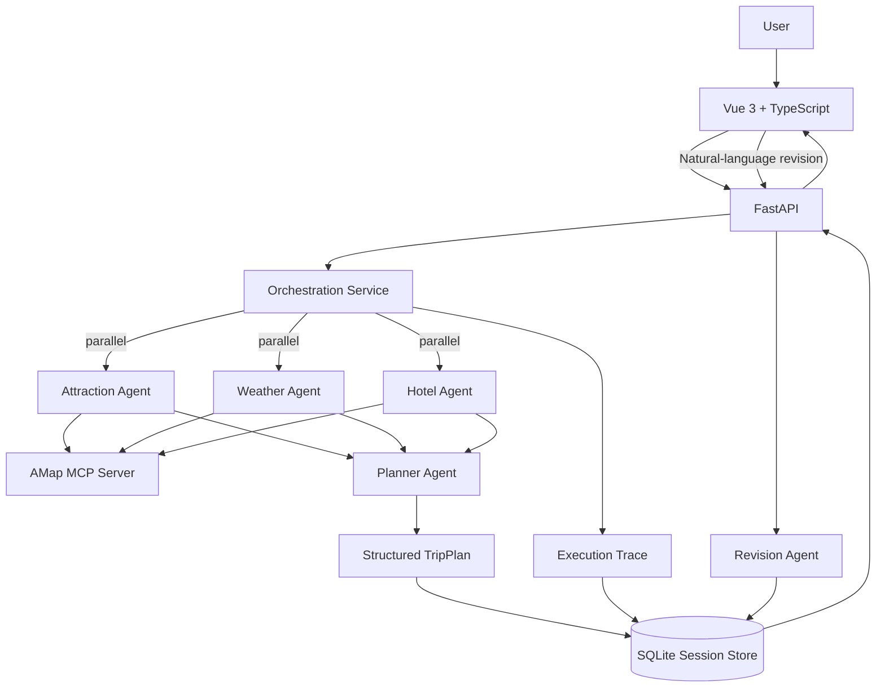

# Multi-Agent Trip Planner

一个面向真实旅行规划场景的 **多智能体（Multi-Agent）AI 应用**。

项目使用 HelloAgents 构建多个专职 Agent，通过 **MCP（Model Context Protocol）** 接入高德地图能力，并以 FastAPI + Vue 3 完成任务编排、真实工具调用、结构化结果生成、会话持久化、自然语言修订和 Agent Execution Trace 展示。

> 这个项目的重点不是“让大模型写一段旅行文案”，而是把 **Agent Orchestration、Tool Calling、Structured Output、State Persistence 与 Observability** 组合成一个可运行、可观察、可继续工程化的 Agent System。

## Highlights

- **Multi-Agent Decomposition**：景点、天气、酒店、行程规划分别由专职 Agent 处理
- **Parallel Orchestration**：三个检索型 Agent 采用 fan-out / fan-in 并行任务编排
- **MCP Tool Calling**：通过高德地图 MCP 获取 POI、天气和路线等真实外部信息
- **Structured Output**：Planner Agent 输出受 Pydantic 模型约束的 TripPlan
- **Persistent Session**：使用 SQLite 保存当前行程、历史版本和执行轨迹
- **Natural-language Revision**：用户可基于 session_id 继续用自然语言局部修改行程
- **Agent Observability**：前端独立 Execution Trace 页面展示 Agent、Tool、Status、Latency 和错误信息

## Architecture



## Agent Workflow

一次旅行规划请求会经历：

```text
User Request
    ↓
FastAPI
    ↓
Orchestrator
    ├── Attraction Agent ── MCP / AMap ─┐
    ├── Weather Agent ───── MCP / AMap ─┼── parallel
    └── Hotel Agent ─────── MCP / AMap ─┘
                    ↓ fan-in
               Planner Agent
                    ↓
             Structured TripPlan
                    ↓
        SQLite Session + Execution Trace
                    ↓
            Vue Result / Trace UI
```

Attraction、Weather、Hotel 三个任务之间没有直接数据依赖，因此由 `ThreadPoolExecutor` 并发调度；Planner Agent 等待三类结果汇合后再生成最终结构化行程。

## Agent Execution Trace

每个步骤都会记录统一的执行事件：

```json
{
  "agent": "Weather Agent",
  "task": "查询目的地天气",
  "tool": "amap_maps_weather",
  "status": "success",
  "duration_ms": 1264.42,
  "error": null
}
```

前端 `/trace` 页面会把一次会话中的执行过程展示为：

- 三个并行检索 Agent
- Planner 汇总节点
- Agent 状态
- MCP Tool 名称
- 单步耗时
- 总编排耗时
- 失败 / fallback 信息
- 简短结果预览

这让项目不仅能够“运行 Agent”，也能够观察 Agent 为什么成功或失败。

## Persistent Session & Revision

首次生成计划后，后端会创建 `session_id`，并把以下数据持久化到 SQLite：

```text
session_id
current_plan
history
execution_trace
created_at
updated_at
```

用户可以继续输入：

```text
把第二天上午的博物馆换成一个适合拍照的公园，其他安排不变。
```

Revision Agent 会基于当前 TripPlan 做局部调整；旧版本会进入 `history`，新的 Revision Trace 也会追加到当前 Session。

因此服务重启后，会话不再因为 Python 进程内存清空而直接丢失。

## Tech Stack

### Agent / Backend

- Python
- HelloAgents / SimpleAgent
- MCPTool / Model Context Protocol
- AMap MCP Server
- FastAPI
- Pydantic
- SQLite
- `concurrent.futures.ThreadPoolExecutor`
- 可配置 LLM Provider / Model

### Frontend

- Vue 3
- TypeScript
- Vue Router
- Vite
- Ant Design Vue
- Axios
- AMap JavaScript API
- html2canvas / jsPDF

## Project Structure

```text
multi-agent-trip-planner/
├── backend/
│   ├── app/
│   │   ├── agents/
│   │   │   └── trip_planner_agent.py
│   │   ├── api/
│   │   │   └── routes/
│   │   │       ├── trip.py
│   │   │       ├── map.py
│   │   │       └── poi.py
│   │   ├── models/
│   │   │   └── schemas.py
│   │   └── services/
│   │       ├── orchestration_service.py  # 并行任务编排 + Trace
│   │       ├── session_service.py        # SQLite 会话持久化
│   │       ├── amap_service.py
│   │       ├── llm_service.py
│   │       └── unsplash_service.py
│   ├── requirements.txt
│   └── run.py
├── frontend/
│   ├── src/
│   │   ├── services/
│   │   ├── types/
│   │   └── views/
│   │       ├── Home.vue
│   │       ├── Result.vue
│   │       └── Trace.vue               # Agent Execution Trace
│   └── package.json
└── README.md
```

## Quick Start

### Requirements

- Python 3.10+
- Node.js 16+
- AMap API Key
- 一个兼容 HelloAgents 的 LLM API 配置

### Backend

```bash
cd backend
python -m venv venv
source venv/bin/activate
pip install -r requirements.txt
cp .env.example .env
uvicorn app.api.main:app --reload --host 0.0.0.0 --port 8000
```

FastAPI Docs：

```text
http://localhost:8000/docs
```

### Frontend

```bash
cd frontend
npm install
cp .env.example .env
npm run dev
```

默认访问：

```text
http://localhost:5173
```

生成一次旅行计划后，可以从顶部导航进入：

```text
http://localhost:5173/trace
```

查看当前 Session 的 Agent Execution Trace。

## Core APIs

### Generate Trip Plan

```http
POST /api/trip/plan
```

返回：

```text
session_id + TripPlan + execution_trace
```

### Revise Trip Plan

```http
POST /api/trip/revise
```

```json
{
  "session_id": "<session-id>",
  "feedback": "把第二天上午的景点换成适合拍照的公园，其他安排不变"
}
```

### Read Persistent Session

```http
GET /api/trip/session/{session_id}
```

可读取当前计划、历史版本以及完整 Execution Trace。

### Read Execution Trace

```http
GET /api/trip/trace/{session_id}
```

用于可观测性页面或调试工具直接消费。

## Engineering Decisions

### Why separate Orchestrator from Agent implementation?

`trip_planner_agent.py` 关注单个 Agent 的能力与 Prompt；`orchestration_service.py` 负责：

- 任务依赖关系
- 并行调度
- fan-out / fan-in
- 错误隔离
- latency 统计
- execution trace

这样后续增加 Coordinator、DAG 或异步任务队列时，不需要把调度逻辑继续堆进 Agent 类。

### Why SQLite first?

当前项目是单机作品集应用，SQLite 能以很低复杂度解决“进程重启后 Session 丢失”的核心问题，同时保持数据模型清晰。

如果进一步部署为多实例服务，可以把 Session Store 替换为 PostgreSQL / Redis，而上层 API 和 Agent 工作流不需要大改。

## Current Boundaries

当前版本已经完成并行编排、持久化和基础 Trace，但仍有明确的工程化空间：

- 当前 Agent 路由仍是固定任务图，还不是动态 Coordinator / Router
- Execution Trace 记录 Agent / Tool / latency / error，但还没有 token usage 与 LLM span
- MCP 工具层还需要进一步统一 timeout / retry / circuit breaker
- Session Store 当前使用 SQLite，暂未面向多实例并发部署
- 缺少系统化的 Agent Eval Dataset 和自动回归指标
- 尚未加入 CI、容器化部署和生产级日志体系

## Roadmap

- [x] Multi-Agent 任务拆分
- [x] MCP Tool Calling
- [x] Structured TripPlan
- [x] 自然语言行程修订
- [x] 并行 fan-out / fan-in Agent Orchestration
- [x] SQLite Session Persistence
- [x] Agent Execution Trace API
- [x] Execution Trace 可视化页面
- [ ] Coordinator / Router 动态任务选择
- [ ] Tool timeout / retry / fallback policy
- [ ] Agent Eval Dataset + regression metrics
- [ ] token usage / model span tracing
- [ ] automated tests + CI
- [ ] Docker / deployment

## Why This Project

相比普通 LLM Chat Demo，本项目主要验证这些 Agent Engineering 问题：

- 如何把复杂业务目标拆成多个 Agent 任务
- 哪些任务可以并行，哪些任务存在数据依赖
- 如何让 Agent 通过 MCP 使用真实外部工具
- 如何把模型结果约束成前端可消费的结构化数据
- 如何维护跨多轮交互的任务状态和历史版本
- 如何让 Agent 执行过程可观察、可调试、可解释
- 如何把上述能力整合进一个真正可运行的全栈产品

因此它既是旅行规划应用，也是一个 **Multi-Agent + MCP + Orchestration + Observability + Full-stack AI Application** 的工程实践。

## License

CC BY-NC-SA 4.0

## Acknowledgements

- [Hello-Agents](https://github.com/datawhalechina/Hello-Agents)
- [HelloAgents](https://github.com/jjyaoao/HelloAgents)
- [高德地图开放平台](https://lbs.amap.com/)
- [amap-mcp-server](https://github.com/sugarforever/amap-mcp-server)
