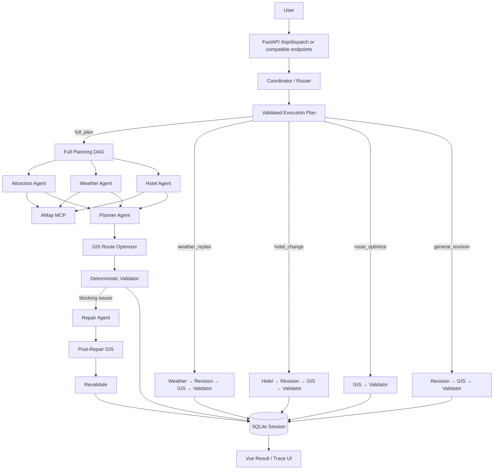

# Architecture

## 1. System Goal

Multi-Agent Trip Planner is designed as an Agent application rather than a text-generation demo. The system combines LLM-based semantic planning with deterministic task routing, real tools, GIS optimization, validation, repair, persistence, and observability.

The core design principle is:

```text
Coordinator → understand the task type
LLM         → semantic planning / revision
MCP         → obtain real external data
GIS         → calculate travel cost and visit order
Rules       → validate hard constraints and protect locks
Trace       → explain what happened
Eval        → measure whether the system works
```

The LLM never receives permission to invoke arbitrary Python functions. Coordinator output is treated as untrusted input and is converted into a backend-owned allow-listed execution graph.

## 2. Dynamic End-to-End Flow



## 3. Coordinator / Router

The Coordinator is request-scoped and classifies a natural-language task into one of five intents:

```text
full_plan
weather_replan
hotel_change
route_optimize
general_revision
```

It may suggest capabilities, but the backend does not execute that list directly. Instead, the selected intent is mapped to a canonical graph owned by Python code.

Example LLM output:

```json
{
  "intent": "weather_replan",
  "requested_capabilities": ["weather", "revision", "gis", "validator"],
  "reason": "用户要求根据降雨调整已有行程"
}
```

Canonical backend graph:

```text
Weather Agent
     ↓
Revision Agent
     ↓
GIS Optimizer
     ↓
Validator
```

Unknown capabilities, custom edges, or invented function names are ignored. If the Coordinator LLM fails or returns invalid JSON, a deterministic heuristic router provides a visible fallback rather than failing the whole request.

### Why this design?

A fully autonomous supervisor can decide both what to call and how to call it, but that is harder to test and easier to make unsafe or unstable. This project deliberately separates responsibilities:

```text
LLM  → classify semantic task
Code → validate intent and own the executable DAG
```

This preserves Agent flexibility without giving the model unrestricted orchestration control.

## 4. Canonical Task Graphs

### Full planning

```text
Attraction ┐
Weather    ├─ parallel fan-out
Hotel      ┘
    ↓ fan-in
Planner
    ↓
GIS
    ↓
Validator
    ↓ conditional
Repair → GIS → Revalidate
```

### Weather-driven re-plan

```text
Weather
   ↓
Revision
   ↓
GIS
   ↓
Validator
```

### Hotel change

```text
Hotel
  ↓
Revision
  ↓
GIS
  ↓
Validator
```

### Route-only optimization

```text
GIS
 ↓
Validator
```

No Attraction, Weather, Hotel, Planner, or Revision Agent is called when the user only asks to reorder existing POIs.

### General revision

```text
Revision
   ↓
GIS
   ↓
Validator
```

## 5. Agent Responsibilities

### Attraction Agent
Retrieves candidate POIs and attraction-related information through AMap MCP.

### Weather Agent
Retrieves weather information. It is used during full planning and can also be selected dynamically for weather-driven revisions.

### Hotel Agent
Retrieves accommodation candidates. It can be selected independently when a later request only concerns lodging.

### Planner Agent
Combines retrieval results and structured user constraints into a typed `TripPlan`. It owns semantic planning, not route optimization or hard-rule enforcement.

### Repair Agent
Runs only when full-plan deterministic validation finds blocking issues. It receives the current plan, structured constraints, and concrete validation failures and makes one bounded correction.

### Revision Agent
Handles natural-language changes to an existing plan. Dynamic orchestration can enrich its input with newly retrieved Weather or Hotel context.

### Coordinator Agent
Classifies the current task and explains the routing reason. It does not directly call tools and does not own the executable dependency graph.

## 6. Orchestration Strategy

The system now has two complementary orchestration modes.

### Fixed DAG for known full-plan work

A complete trip request has stable dependencies, so Attraction, Weather, and Hotel run in parallel and fan in to Planner. This is faster and more predictable than asking an LLM supervisor to rediscover the same graph every time.

### Dynamic DAG selection for continuation tasks

Later user requests vary. The Coordinator chooses the smallest canonical task graph that can satisfy the request.

Examples:

```text
"明天下雨，把第二天改成室内" → Weather → Revision → GIS → Validator
"酒店换便宜一点"             → Hotel → Revision → GIS → Validator
"这三个景点怎么排最省时间"   → GIS → Validator
"第三天轻松一点"             → Revision → GIS → Validator
```

This reduces unnecessary LLM/tool calls and makes the multi-Agent system task-aware instead of forcing every request through the same pipeline.

## 7. Session Context

SQLite now stores the original `TripRequest` together with the plan:

```text
session_id
request
current_plan
history
execution_trace
locks
created_at
updated_at
```

Persisting the original request matters because later GIS and Validator steps still need the original transportation mode and hard constraints. Legacy sessions without this field are handled with a conservative inference fallback.

## 8. Structured Constraints

The backend converts explicit natural-language requirements into typed constraints when they can be quantified safely.

Supported examples include:

```text
预算不超过 2500 元
每天最多 3 个景点
每天游览最多 6 小时
单段交通不要超过 45 分钟
```

These constraints are passed to planning and later enforced by deterministic validation. Ambiguous preferences remain semantic preferences rather than being forced into hard constraints.

## 9. GIS Route Optimization

The system deliberately separates "which attractions should be visited" from "in which order should they be visited".

```text
Planner / existing plan chooses POI set
        ↓
POI coordinates
        ↓
Directed cost matrix
   ├─ AMap route time
   └─ Haversine fallback
        ↓
Route permutation search
        ↓
Lower-cost visit order
```

For normal daily itineraries with only a few attractions, exact permutation search is practical and avoids asking the LLM to guess spatial relationships.

The optimizer records original/optimized order, travel minutes before/after, saved minutes, route-data source, and evaluated permutations.

## 10. Deterministic Validation

The validator checks issues that can be judged without another LLM, including:

- requested trip length versus generated itinerary length
- total budget limit
- daily attraction-count limit
- daily visit-time limit
- duplicate attractions
- maximum travel time between adjacent attractions
- route data source and fallback state

Deterministic checks are repeatable, testable, and directly usable in evaluation metrics.

## 11. Repair Loop

Full planning uses a bounded correction loop:

```text
Generate
→ GIS Optimize
→ Validate
→ Repair once if necessary
→ GIS Optimize again
→ Revalidate
→ Stop
```

The system does not allow unbounded Planner/Reviewer loops. If blocking issues remain, the run is marked degraded rather than being presented as fully successful.

## 12. Revision Locks

Users can preserve confirmed parts of the plan while changing another part.

Example:

```text
第一天和酒店已经确定，不要改，把第三天改轻松一点。
```

Locks can cover specific days, all hotels/accommodation, or named attractions. The deterministic `Revision Lock Guard` restores any locked data changed by Revision or GIS and records the violation in the trace.

## 13. Reliability

Failures are classified into categories such as timeout, rate_limit, network, auth, validation, and agent_error.

Retry behavior is category-aware. Authentication errors do not retry; transient failures may retry with backoff; exhausted attempts become explicit fallback/degraded states. Fallback behavior does not fabricate POIs, weather, coordinates, or successful tool results.

## 14. Observability

Trace can now show both the selected graph and its execution:

```text
Coordinator
   ↓
Execution Plan
   ↓
selected Agent / GIS / Validator nodes
   ↓
Dynamic Orchestrator
```

Each Coordinator event includes the intent, plan source (`llm` or `heuristic_fallback`), canonical capabilities, dependencies, and routing reason.

Other trace events expose status, latency, attempts, retry history, tool names, validation issues, GIS before/after results, route source, lock violations, and degraded state.

## 15. Why A2UI Is Not Used

The current travel result has a stable and well-defined structure. The dynamic part is primarily the execution graph and data, not the UI schema.

Typed `TripPlan` data rendered by deterministic Vue components is therefore easier to test and maintain. A2UI becomes reasonable only if the product evolves into a broader workspace where the Agent must dynamically choose fundamentally different interaction surfaces.