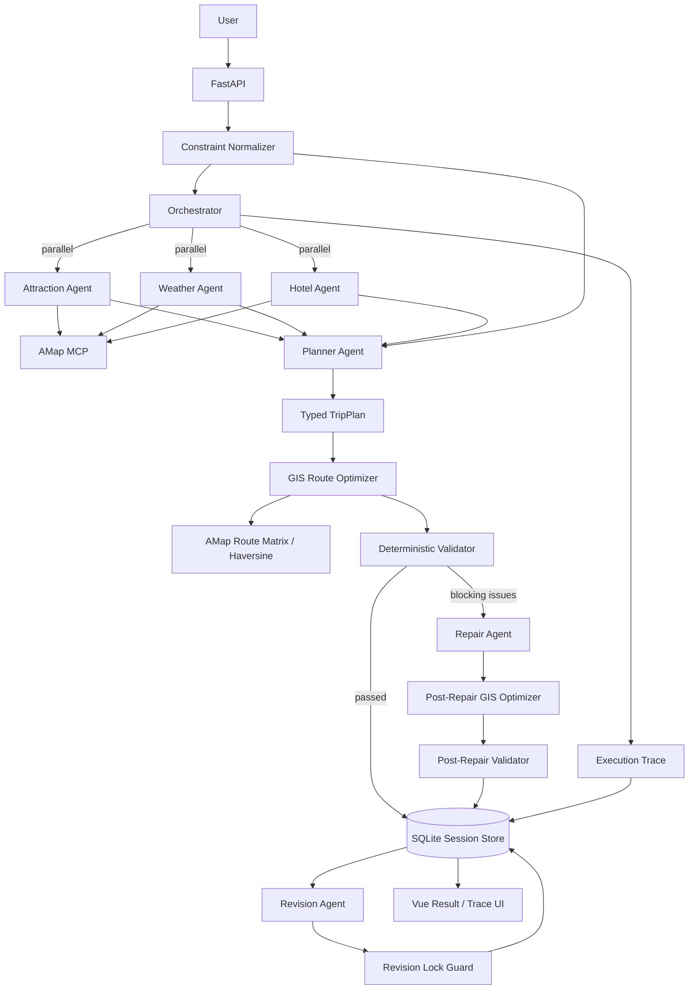

# Architecture

## 1. System Goal

Multi-Agent Trip Planner is designed as an Agent application rather than a text-generation demo. The system combines LLM-based semantic planning with deterministic constraints, GIS optimization, validation, repair, persistence, and observability.

The core design principle is:

```text
LLM       → understand intent and choose what to visit
MCP       → obtain real external data
GIS       → calculate travel cost and visit order
Rules     → enforce deterministic constraints
Agent     → repair semantic planning errors
Trace     → explain what happened
Eval      → measure whether the system works
```

## 2. End-to-End Flow



## 3. Agent Responsibilities

### Attraction Agent
Retrieves candidate POIs and attraction-related information through AMap MCP.

### Weather Agent
Retrieves weather information used by the planner when producing daily plans.

### Hotel Agent
Retrieves accommodation candidates and related information.

### Planner Agent
Combines retrieval results and structured user constraints into a typed `TripPlan`. It is responsible for semantic planning, not for route optimization or rule enforcement.

### Repair Agent
Runs only when deterministic validation finds blocking issues. It receives the current plan, structured constraints, and concrete validation failures, and is instructed to make the smallest necessary correction.

### Revision Agent
Handles later natural-language changes to an existing plan while respecting persistent revision locks.

## 4. Orchestration

Attraction, Weather, and Hotel Agents run with fan-out / fan-in parallel orchestration. Their outputs are collected before the Planner Agent executes.

Agents are request-scoped instead of long-lived shared instances. This prevents `SimpleAgent` history from leaking between different users, sessions, or evaluation cases.

Automatic repair is intentionally bounded:

```text
Generate
→ GIS Optimize
→ Validate
→ Repair once if necessary
→ GIS Optimize again
→ Revalidate
→ Stop
```

The system does not allow unbounded Planner/Reviewer loops.

## 5. Structured Constraints

The backend converts explicit natural-language requirements into typed constraints when they can be quantified safely.

Supported examples include:

```text
预算不超过 2500 元
每天最多 3 个景点
每天游览最多 6 小时
单段交通不要超过 45 分钟
```

These constraints are passed to planning and are later enforced by deterministic validation. Ambiguous preferences remain semantic preferences rather than being forced into hard constraints.

## 6. GIS Route Optimization

The system deliberately separates "which attractions should be visited" from "in which order should they be visited".

```text
Planner chooses POI set
        ↓
POI coordinates
        ↓
Directed cost matrix
   ├─ AMap route time
   └─ Haversine fallback
        ↓
Route permutation search
        ↓
Lower-cost visit order
```

For normal daily itineraries with only a few attractions, exact permutation search is practical and avoids asking the LLM to guess spatial relationships.

The optimizer records:

- original order
- optimized order
- travel minutes before/after
- estimated minutes saved
- route-data source
- number of evaluated permutations

For larger attraction sets, the implementation avoids excessive external route calls by falling back to coordinate-based spatial cost estimation.

## 7. Deterministic Validation

The validator checks issues that can be judged without another LLM, including:

- requested trip length versus generated itinerary length
- total budget limit
- daily attraction-count limit
- daily visit-time limit
- duplicate attractions
- maximum travel time between adjacent attractions
- route data source and fallback state

Deterministic checks are repeatable, testable, and directly usable in evaluation metrics.

## 8. Repair Loop

When validation finds blocking issues, the Repair Agent receives:

```text
Current TripPlan
+ Structured Constraints
+ Validator Blocking Issues
```

After repair, the plan goes through GIS optimization and validation again. If blocking issues remain, the run is marked degraded rather than being presented as fully successful.

## 9. Revision Locks

Users can preserve confirmed parts of the plan while changing only another part.

Example:

```text
第一天和酒店已经确定，不要改，把第三天改轻松一点。
```

Locks can cover:

- specific days
- all hotels/accommodation
- named attractions

The Revision Agent receives the lock state, but a deterministic `Revision Lock Guard` also compares the original and revised plans. If the model changes locked data, the backend restores the original value and records the violation in the execution trace.

Locks persist in SQLite with the session.

## 10. Reliability

Failures are classified into categories such as:

```text
timeout
rate_limit
network
auth
validation
agent_error
```

Retry behavior is category-aware:

- timeout / network / rate limit: limited retry with backoff
- authentication errors: no retry
- Planner JSON/Pydantic validation failures: regeneration is allowed
- exhausted attempts: explicit fallback/degraded state

Fallback behavior does not fabricate POIs, weather, coordinates, or successful tool results.

## 11. Persistence

SQLite stores:

```text
session_id
current_plan
history
execution_trace
locks
created_at
updated_at
```

This allows plan history, revision locks, and trace information to survive page refreshes and service restarts.

## 12. Observability

A complete planning trace may contain:

```text
Attraction Agent ┐
Weather Agent    ├── parallel
Hotel Agent      ┘
       ↓
Planner Agent
       ↓
GIS Route Optimizer
       ↓
Trip Validator
       ↓ (if required)
Repair Agent
       ↓
Post-Repair GIS Optimizer
       ↓
Post-Repair Validator
       ↓
Orchestrator
```

Revision flows add:

```text
Revision Agent
      ↓
Revision Lock Guard
```

Trace events can expose status, latency, attempts, retry history, error categories, tool names, validation issues, route source, GIS before/after results, lock violations, and degraded state.

## 13. Why A2UI Is Not Used

The current travel result has a stable and well-defined structure. The dynamic part is primarily the data, not the UI schema.

For this project, typed `TripPlan` data rendered by deterministic Vue components is easier to test and maintain than introducing an Agent-driven UI protocol.

A2UI would become reasonable if the product evolves into a broader travel workspace where the Agent must dynamically choose among fundamentally different interaction surfaces such as comparison tables, approval forms, editors, and task dashboards.