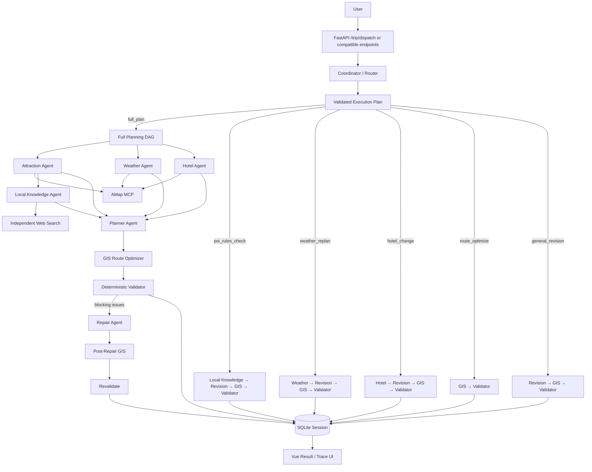

# Architecture

## 1. System Goal

Multi-Agent Trip Planner is designed as an Agent application rather than a text-generation demo. The system combines semantic planning, multi-source retrieval, deterministic task routing, GIS optimization, validation, repair, persistence, and observability.

The core design principle is:

```text
Coordinator     → understand the task type
LLM             → semantic planning / revision
AMap MCP        → POI / weather / hotel / route data
Web Search      → source-backed operating information
Local Knowledge → verify opening / reservation / closure rules
GIS             → calculate travel cost and visit order
Rules           → validate hard constraints and protect locks
Trace           → explain what happened
Eval            → measure whether the system works
```

The LLM never receives permission to invoke arbitrary Python functions. Coordinator output is treated as untrusted input and converted into a backend-owned allow-listed execution graph.

## 2. Dynamic End-to-End Flow



## 3. Coordinator / Router

The Coordinator is request-scoped and classifies a natural-language task into one of six intents:

```text
full_plan
poi_rules_check
weather_replan
hotel_change
route_optimize
general_revision
```

It may suggest capabilities, but the backend does not execute that list directly. The selected intent maps to a canonical graph owned by Python code.

Example:

```json
{
  "intent": "poi_rules_check",
  "requested_capabilities": ["local_knowledge", "revision", "gis", "validator"],
  "reason": "用户要求核验景点预约与开放规则"
}
```

The executable graph remains backend-owned:

```text
Local Knowledge Agent
        ↓
Revision Agent
        ↓
GIS Optimizer
        ↓
Validator
```

Unknown capabilities, custom edges, or invented function names are ignored. If the Coordinator LLM fails or returns invalid JSON, a deterministic heuristic router provides a visible fallback.

The separation is deliberate:

```text
LLM  → classify semantic task
Code → validate intent and own the executable DAG
```

## 4. Canonical Task Graphs

### Full planning

Local Knowledge depends on the attraction candidates, so it intentionally runs after the first fan-out rather than in parallel with Attraction.

```text
Attraction ┐
Weather    ├─ parallel fan-out
Hotel      ┘
    │
    └─ Attraction result → Local Knowledge
                         ↓
                Planner fan-in
                         ↓
                        GIS
                         ↓
                     Validator
                         ↓ conditional
                  Repair → GIS → Revalidate
```

### POI operating-rule check

```text
Local Knowledge
      ↓
Revision
      ↓
GIS
      ↓
Validator
```

For an existing Session, Local Knowledge builds its query from POIs already present in the plan, so Attraction does not need to run again.

### Weather-driven re-plan

```text
Weather → Revision → GIS → Validator
```

### Hotel change

```text
Hotel → Revision → GIS → Validator
```

### Route-only optimization

```text
GIS → Validator
```

No Retrieval or Planner Agent is called when the user only asks to reorder existing POIs.

### General revision

```text
Revision → GIS → Validator
```

## 5. Agent Responsibilities

### Attraction Agent
Retrieves candidate POIs, addresses and coordinate-oriented attraction data through AMap MCP.

### Local Knowledge Agent
Owns a separate information boundary. It verifies facts that map search alone is not sufficient to establish reliably:

```text
opening hours
last-entry time
reservation / real-name requirements
fixed closure days
ticket / admission rules
temporary closures and holiday notices
```

The default retrieval provider is Tavily Web Search. Search obtains evidence; the Local Knowledge Agent interprets that evidence. It is explicitly forbidden from inventing operating facts when sources are missing.

This Agent exists because it has a genuinely different data source and failure mode, not because the project needs a larger Agent count.

### Weather Agent
Retrieves weather information through AMap MCP. It participates in full planning and weather-driven revisions.

### Hotel Agent
Retrieves accommodation candidates through AMap MCP. It can be selected independently for hotel-only changes.

### Planner Agent
Combines Attraction, Weather, Hotel, Local Knowledge and typed constraints into `TripPlan`. It owns semantic itinerary construction, not GIS ordering or deterministic rule enforcement.

### Repair Agent
Runs only when full-plan Validator finds blocking issues. It receives the current plan, constraints and concrete validation failures, then makes one bounded correction.

### Revision Agent
Handles natural-language changes to an existing plan. Coordinator-selected Weather, Hotel or Local Knowledge results can be injected as fresh context before revision.

### Coordinator Agent
Classifies the task and explains routing. It does not directly call tools and does not own executable dependency edges.

## 6. Multi-Source Retrieval Boundary

The system distinguishes location data from operational knowledge:

```text
AMap MCP
→ where is it?
→ what POI is it?
→ what is the route cost?
→ weather / hotel candidates

Independent Web Search
→ can I visit on this date?
→ does it require reservation?
→ is there a closure or special notice?
```

For Local Knowledge, every usable summary keeps source URLs in Trace. Non-verified information remains a warning and must not silently become a hard fact.

When `TAVILY_API_KEY` is absent, the Local Knowledge step explicitly falls back and tells downstream Agents not to guess missing rules.

## 7. Orchestration Strategy

The system has two complementary orchestration modes.

### Fixed DAG for known full-plan work

A complete trip request has stable dependencies. Attraction, Weather and Hotel run concurrently; Local Knowledge waits for Attraction candidates; Planner then receives all retrieval context. This is faster and more predictable than asking an LLM supervisor to rediscover the graph every time.

### Dynamic DAG selection for continuation tasks

Later requests vary, so Coordinator selects the smallest canonical graph.

```text
"故宫要预约吗？周一闭馆就调整" → Local Knowledge → Revision → GIS → Validator
"明天下雨，把第二天改成室内"   → Weather → Revision → GIS → Validator
"酒店换便宜一点"               → Hotel → Revision → GIS → Validator
"这三个景点怎么排最省时间"     → GIS → Validator
"第三天轻松一点"               → Revision → GIS → Validator
```

This reduces unnecessary model/tool calls and makes the system task-aware without allowing unrestricted autonomous execution.

## 8. Session Context

SQLite stores the original `TripRequest` together with the plan:

```text
session_id
request
current_plan
history
execution_trace
locks
created_at
updated_at
```

Later Local Knowledge, GIS and Validator steps can therefore recover dates, transportation mode and original hard constraints. Legacy sessions without the request field use conservative inference.

## 9. Structured Constraints

Quantifiable user requirements become typed constraints, for example:

```text
预算不超过 2500 元
每天最多 3 个景点
每天游览最多 6 小时
单段交通不要超过 45 分钟
```

These constraints are passed to planning and enforced again by deterministic validation. Ambiguous preferences remain semantic preferences.

## 10. GIS Route Optimization

The system separates "which attractions should be visited" from "in which order should they be visited".

```text
Planner / current plan chooses POI set
        ↓
POI coordinates
        ↓
Directed cost matrix
   ├─ AMap route time
   └─ Haversine fallback
        ↓
Exact permutation search for small daily sets
        ↓
Lower-cost visit order
```

The optimizer records original/optimized order, travel minutes before/after, saved minutes, source and evaluated permutations.

## 11. Deterministic Validation

Validator checks issues that do not need another LLM:

- requested trip length
- total budget
- daily attraction-count limit
- daily visit-time limit
- duplicate attractions
- maximum adjacent-route time
- route-data source / fallback state

These checks are repeatable and directly measurable in Eval.

## 12. Repair Loop

Full planning uses a bounded correction loop:

```text
Generate
→ GIS Optimize
→ Validate
→ Repair once if necessary
→ GIS Optimize again
→ Revalidate
→ Stop
```

The system does not permit unbounded Planner/Reviewer loops. Unresolved blocking issues produce a degraded state.

## 13. Revision Locks

Users can preserve confirmed days, hotels or named attractions. The deterministic Lock Guard restores locked content changed by Revision or GIS and records violations in Trace.

## 14. Reliability

Failures are classified into categories such as timeout, rate_limit, network, auth, validation and agent_error.

Transient errors can retry with backoff; authentication errors do not retry; exhausted attempts become explicit fallback/degraded states. Fallback never fabricates POIs, weather, coordinates, Local Knowledge or successful tool calls.

## 15. Observability

Trace shows both routing and execution:

```text
Coordinator
   ↓
Execution Plan
   ↓
Selected Agent / Local Knowledge / GIS / Validator nodes
   ↓
Dynamic Orchestrator
```

Local Knowledge events additionally expose:

```text
provider
source title
source URL
relevance score
fallback/error state
latency
```

Other events expose status, attempts, retry history, validation issues, GIS before/after results, route sources, lock violations and degraded state.

## 16. Why A2UI Is Not Used

The current result has a stable `TripPlan` structure. The dynamic part is the execution graph and business data, not the UI schema.

Typed data rendered by deterministic Vue components is therefore easier to test and maintain. A2UI becomes useful only if the product evolves into a broader workspace where the Agent must dynamically select fundamentally different interaction surfaces.
